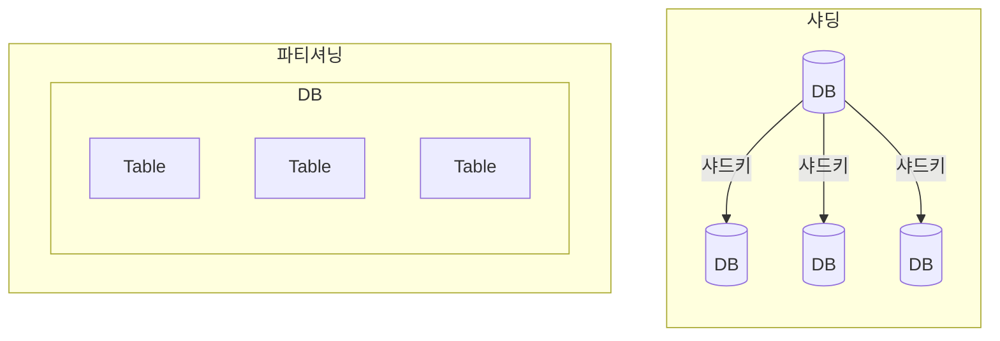

## 샤딩, 파티셔닝 개념

- 파티셔닝: 큰 테이블을 관리하기 쉬운 단위로 분할하는 기법
- 샤딩: 테이블을 분리하여 다수의 물리DB서버에 분산 저장하는 기법

## 샤딩, 파티셔닝 구성요소, 활용사례, 주요 데이터베이스 분할 기법

### 샤딩, 파티셔닝 구성요소 비교

| 구분 | 샤딩 | 파티셔닝 |
| --- | --- | --- |
| 목적 | 시스템 부하 분산, 대규모 데이터 처리, 고가용성 | 데이터 관리용이, 데이터 접근 최적화 |
| 분할방법 | 수평분할 | 수직분할 |
| 분할관점 | 테이블을 여러 DB로 분할 | 하나의 DB에서 테이블 분할 |
| 관리노드 | 샤드간 라우팅 수행용 마스터 | 마스터노드 없음 |
| 관리 복잡성 | 상대적으로 높음 | 상대적으로 낮음 |
| 테이블연동 | 분할 테이블 간 조인 불가 | 테이블 간 조인 가능 |

### 샤딩, 파티셔닝 활용사례

| 기법 | 활용 사례 | 예시 |
| --- | --- | --- |
| 샤딩 | 소셜 미디어 플랫폼 | Facebook의 지역별 샤딩으로 사용자 데이터 분산 저장 |
| 샤딩 | 전자상거래 플랫폼 | 주문 데이터를 샤딩하여 결제 처리 성능 최적화 |
| 파티셔닝 | 데이터 웨어하우스 | 과거 데이터를 연도별로 파티셔닝하여 쿼리 성능 개선 |
| 파티셔닝 | 은행 시스템 | 고객 데이터를 지역별로 파티셔닝하여 빠른 접근 제공 |

### 주요 데이터베이스 분할 기법

| 구분 | 내용 | 비고 |
| --- | --- | --- |
| Vertical 분할 | 테이블별, 열별 분할 | 구현 간단 |
| Range-Based 분할 | 하나의 기능이나 테이블이 비대해질시 행 분할 | 예측 가능성 |
| Key 또는 Hash 분할 | 엔티티를 해싱하여 분할 결정 | 균등분포 해싱함수 |
| Directory 기반 분할 | 파티셔닝 매커니즘을 제공하는 추상화된 서비스를 사용하여 분할 | 샤딩 사용, 샤드키 연동 |

## 데이터베이스 분할 절차도, 세부절차

### 데이터베이스 분할 절차도

### 데이터베이스 분할 세부절자

| 구분 | 내용 | 비고 |
|---|---|---|
| 1. 분할 필요성 증가 | 데이터 양 증가로 인한 성능 저하 | 모니터링 지표 기준 설정 필요 |
| | 특정 시간대 과부하 발생 | |
| 2. 분할 방법 결정 | 샤딩 vs 파티셔닝 선택 | 업무 특성과 데이터 접근 패턴 고려 |
| | 수평/수직 분할 결정 | |
| 3. AS-IS 성능 측정 | 현재 시스템의 응답시간 측정 | 기준 성능값 확보 필요 |
| | 주요 쿼리 성능 분석 | |
| 4. 분할 적용, 이관 | DDL 작성 및 스키마 변경 | 서비스 중단 최소화 방안 마련 |
| | 데이터 마이그레이션 수행 | |
| 5. 어플리케이션 수정 | 데이터 접근 로직 수정 | 회귀 테스트 필수 |
| | 샤드 라우팅 로직 추가 | |
| 6. 테스트, 모니터링 | 성능 테스트 | A/B 테스트 권장 |
| | 부하 테스트 | |

## 데이터베이스 분할시 고려사항

| 기법 | 고려사항 | 해결 방안 |
| --- | --- | --- |
| 샤딩 | 데이터 분산 기준 선정 | 사용자 ID, 지역, 시간 등 적절한 기준 설정 |
| 샤딩 | 데이터 균형 유지 | 부하 분산 알고리즘 도입 및 모니터링 |
| 샤딩 | 데이터 일관성 문제 | 분산 트랜잭션 또는 복제 기술 활용 |
| 파티셔닝 | 데이터 접근 패턴 분석 | 파티셔닝 키를 데이터 접근 빈도에 맞게 결정 |
| 파티셔닝 | 데이터 간 의존성 | 파티션 간 데이터 이동 최소화 및 인덱스 최적화 |

- 수평적 확장이 필요한 규모 데이터 분할시 샤딩 고려
- 특정 액세스 패턴 최적화시 파티셔닝 고려
