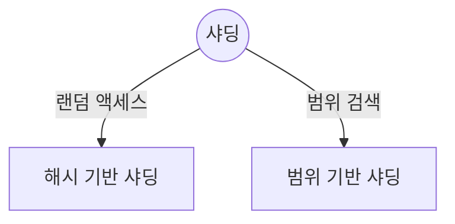
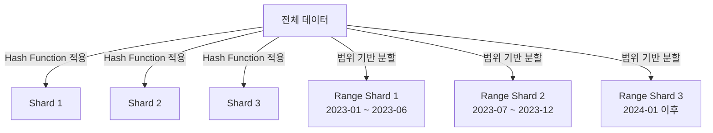

## 샤딩 개념

- 대규모 데이터베이스를 여러 서버에 분산 저장하여 처리 성능을 향상시키는 기법
- 데이터 접근 패턴에 따른 적절한 샤딩 전략 선택 필요

## Hash-based 샤딩, Range-based 샤딩 비교, 활용 사례

### Hash-based 샤딩, Range-based 샤딩 개념 비교

### Hash-based 샤딩, Range-based 샤딩 상세 비교

| 항목 | Hash-based Sharding | Range-based Sharding |
| --- | --- | --- |
| 분배 방식 | 해시 함수 기반 | 범위 기반 |
| 데이터 분포 | 균등 분배 | 불균형 가능 |
| 범위 쿼리 처리 | 비효율적 | 효율적 |
| 샤드 추가/제거 영향 | 전체 데이터 재배치 필요 | 일부 데이터 이동 |

### 샤딩 활용 사례

| 전략 | 적용 사례 | 효과 |
| --- | --- | --- |
| Hash-based Sharding | 소셜 미디어 플랫폼 | 사용자 ID를 해싱하여 부하 균형 유지 |
| Hash-based Sharding | 온라인 게임 | 게임 상태 데이터 분산 저장 |
| Range-based Sharding | 전자상거래 | 날짜별 주문 데이터 저장 및 쿼리 최적화 |
| Range-based Sharding | 금융 서비스 | 계좌 번호 또는 지역 기반 데이터 관리 |

## 샤딩 설계시 고려사항

| 고려사항 | 세부 내용 | 해결 방안 |
| --- | --- | --- |
| 데이터 접근 패턴 | 랜덤 액세스 vs 범위 쿼리 | 랜덤 액세스 → Hash-based |
| | | 범위 쿼리 → Range-based |
| 부하 분산 | 데이터 불균형 발생 가능성 | Hash-based로 균형 유지 |
| 샤드 추가/제거 영향 | 데이터 재배치 비용 | 샤드 크기 확장을 고려한 설계 |
