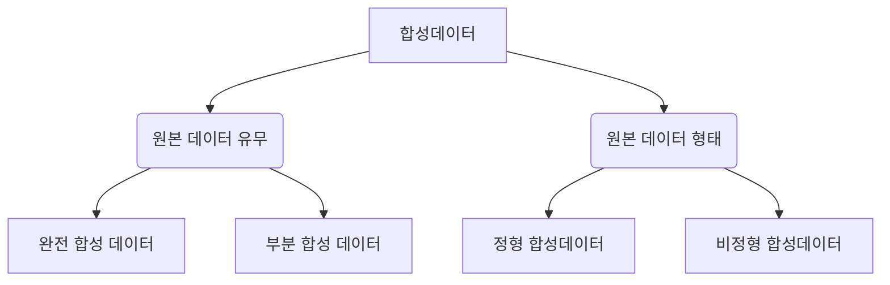

## 합성데이터의 개념

- 원본 데이터를 기반으로 그 형식과 통계적 특성을 학습하여 생성된 가상 데이터
- 개인정보보호를 유지하면서도 산업적 유용성을 제공, 데이터 부족 문제 해결, 민감한 데이터 대체, 다양한 산업에서 새로운 데이터 활용 기회 창출

## 합성데이터의 유형 개념도, 유형, 사례

### 합성데이터의 개념도

### 합성데이터 유형

| 구분 | 유형 | 내용 |
| --- | --- | --- |
| 원본 데이터 유무 | 완전 합성 데이터 | 원본데이터가 전혀 없이 모두 가상으로 생성된 데이터 |
| | 부분 합성 데이터 | 원본 데이터 중 일부데이터셋이나 일부속성변수를 선택하여 합성데이터로 대체 |
| | 복합 합성 데이터 | 일부 변수 값을 합성 데이터로 생성, 합성된 데이터와 실제 데이터를 모두 사용하여 일부 변수 값을 다시 도출하는 방법으로 생성 |
| 원본 데이터 형태 | 정형 합성데이터 | 행과 컬럼으로 이뤄진 테이블 형태의 원본 데이터로부터 생성 |
| | 비정형 합성데이터 | 텍스트, 이미지, 영상 등의 비정형 원본 데이터로부터 생성 |

### 합성데이터 사례

| 구분 | 내용 | 비고 |
| --- | --- | -- |
| 국내 | 자율주행용 합성 비디오데이터셋 | 네이버 Virtual KITTI |
| 국외 | 이미지와 사람 수가 압도적인 군중 계수 데이터셋 | GTA5 Crowd Counting |
| | 실내 장면 이해를 위한 하이퍼 리얼리즘 장면 데이터셋 | 애플 Hypersim |
| | 물리 법칙을 준수하는 3D 합성 데이터셋 | 엔비디아 Cosmos |

## 합성데이터 생성 및 활용절차

### 합성데이터 생성 절차도

| 단계 | 세부 절차 | 주요 활동 |
| --- | --- | --- |
| 사전 준비 | 데이터 수집 | 원본 데이터 확보 및 사용 목적 정의 |
| | 데이터 분석 및 전처리 | 데이터의 특성, 분포, 누락 데이터 탐색 및 정제 |
| 합성 데이터 생성 | 모델 선정 | 통계적 모델, 딥러닝(GAN) 등 적합한 생성 방법 선택 |
| | 데이터 생성 | 원본 데이터의 통계적 특성과 구조를 학습하여 합성 |
| 안전성/유용성 검증 | 개인정보 보호 확인 | 차분 프라이버시, 익명화 등 식별 가능성 제거 |
| | 데이터 품질 평가 | 원본 데이터와의 통계적 유사성 및 목적 적합성 평가 |
| 심의위원회 평가 | 윤리적 검토 및 승인 | 데이터 사용에 따른 윤리적 문제와 법적 준수 여부 확인 |
| 활용 및 관리 | 데이터 활용 및 배포 | 합성 데이터를 목적에 맞게 활용 및 필요한 곳에 배포 |
| | 보관 및 안전한 관리 | 안전한 데이터 저장 및 접근 통제 |

## 합성데이터 고려사항

| 구분 | 고려 사항 | 내용 |
| --- | --- | --- |
| 안전성 | 개인 식별 가능성 제거 | 식별 위험 제거를 위한 차분 프라이버시 적용 |
| 유용성 | 원본 데이터와의 통계적 분포 유사성 유지 | 활용 목적에 맞는 데이터 정확성 보장 |
| 법적 준수 | 개인정보보호법 등 규제 준수 | 데이터 제공 및 활용 시 적법 절차 준수 |
