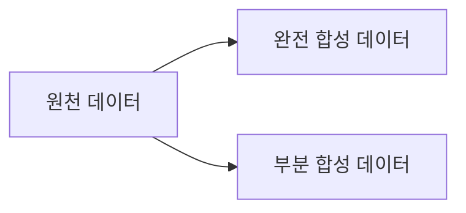

## 합성데이터의 개념

- 실제 데이터의 대체재로서 컴퓨터 시뮬레이션이나 알고리즘을 통해 생성하는 임의의 데이터
- 모델 학습시 충분한 양의 데이터 확보, 양질의 데이터 확보, 개인정보, 저작권 등 이슈 없는 안전한 데이터 확보

## 합성데이터의 유형 개념도, 구성요소, 사례

### 합성데이터의 개념도

### 합성데이터 구성요소

| 구분             | 내용                                                                                                                      | 비고            |
| ---------------- | ------------------------------------------------------------------------------------------------------------------------- | --------------- |
| 완전 합성 데이터 | 공개하려고 하는 데이터에 측정된 실제 데이터가 없는 가상 데이터                                                            | 정보보호 보안성 |
| 부분 합성 데이터 | 공개하려는 변수 중 일부만을 선택하여 합성 데이터로 대체한 데이터                                                          | 민감정보 대체   |
| 복합 합성 데이터 | 일부 변수 값을 합성 데이터로 생성, 합성된 데이터와 실제 데이터를 모두 사용하여 일부 변수 값을 다시 도출하는 방법으로 생성 | 정확성          |

### 합성데이터 사례

| 구분 | 내용                                                | 비고                 |
| ---- | --------------------------------------------------- | -------------------- |
| 국내 | 자율주행용 합성 비디오데이터셋                      | 네이버 Virtual KITTI |
| 국외 | 이미지와 사람 수가 압도적인 군중 계수 데이터셋      | GTA5 Crowd Counting  |
| -    | 실내 장면 이해를 위한 하이퍼 리얼리즘 장면 데이터셋 | 애플 Hypersim        |

## 합성데이터 고려사항

- 데이터 합성시 목표대로 데이터가 만들어졌는지 검증할 수 있는 측정 기준 마련 필요
