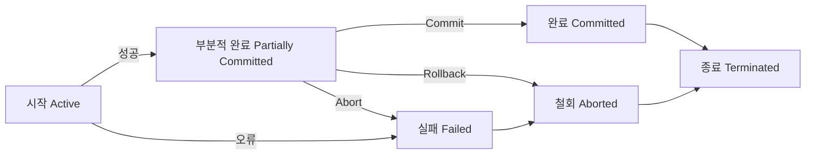

## 데이터베이스 트랜잭션의 개념

- 데이터의 정확환 일관성과 무결성을 보장하기 위해 완전히 종료해야하는 데이터베이스 처리의 논리적 작업 단위

## 데이터베이스 트랜잭션의 특징, 상태전이도, 종료기법

### 데이터베이스 트랜잭션의 특징

| 구분 | 내용 | 보장기법 |
| --- | --- | --- |
| ==원자성== | 연산전체가 처리되거나 처리되지 않아야함 | Commit, Rollback  |
| ==일관성== | 트랜잭션 성공 후 일관된 데이터베이스 상태 유지 | ==무결성 제약조건, 동시성 제어== |
| ==고립성== | 트랜잭션 실행 중 다른 트랜잭션 접근 불가 | ==Isolation Level, Locking, 분산 트랜잭션== |
| ==지속성== | 성공된 트랜잭션은 어떤 고장에도 손실되지 않고 영속 저장 | ==회복기법, 회복컴포넌트 관리== |

- 트랜잭션 특징에 따라 트랜잭션 상태 변경

### 데이터베이스 트랜잭션 상태전이도

> 시작, 부분적완료, 완료, 실패, 철회

- 트랜잭션이 정상적으로 상태 전이되어 작업을 수행하기 위해 ACID와 직렬성 보장 필요

### 데이터베이스 트랜잭션 종료기법

| 구분 | 기법 | 내용 |
| --- | --- | --- |
| ==명시적 처리== | Commit     | 변경 내용을 디스크에 영구 저장, 일관적 상태     |
| -           | Rollback   | 중지 또는 철최하고 갱신 작업취소, 비일관적 상태 |
| ==묵시적 처리== | 정상종료   | Commit과 동일하나 새 트랜잭션 다시 시작 안함    |
| -           | 비정상종료 | Rollback과 동일하나 프로그램 종료               |

## 분산DB 트랜잭션 고려사항

- BASE 특성에 중점을 두어 트랜잭션 구현 및 관리 필요
