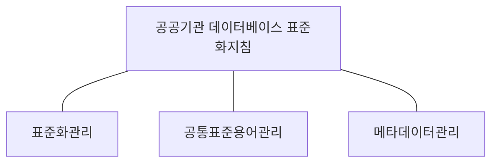

## 공공기관 데이터베이스 표준화지침 개념

- 공공기관이 생성 또는 취득하여 관리하는 데이터베이스 표준화에 필요한 세부 사항을 정립한 지침
- 데이터 품질향상, 호환성, 공공기관 간 데이터 상호운용성, 공공데이터 신뢰성, 투명성 보장

## 공공기관 데이터베이스 표준화지침 구성도, 구성요소, 적용방안

### 공공기관 데이터베이스 표준화지침 구성도

### 공공기관 데이터베이스 표준화지침 구성요소

| 구분 | 내용 | 비고 |
| --- | --- | --- |
| 표준화 관리 | 표준화 관리체계 구축, 표준 수립, 적용, 산출물 관리 | 데이터 표준 사전 작성, 코드 표준 준수 |
| 공통 표준용어 관리 | 공통 표준 용어 관리 원칙, 구성요소 및 관리 항목 | 재개정시 이해관계자 협의 |
| 메타데이터 관리 | 기관 중앙 메타데이터 관리 시스템 구축 및 운영 | 메타데이터 표준 관리항목 등록 |

### 공공기관 데이터베이스 표준화지침 적용방안

| 구분 | 내용 | 비고 |
| --- | --- | --- |
| 공공기관 | 표준화 관리체계 구축, 메타데이터 등록 및 관리  | 기관 여건에 맞는 시행 세칙 제정 |
| 행정안전부 | 예산확보, 지원, 지침 재,개정, 공통 표준 용어 관리 | 표준화 협의체 운영 |
| 데이터 활용지원센터 | 표준화 정책, 제도 조사 및 연구, 기술 개발 및 지원, 홍보 교육 | 전담 조직 구성 및 운영 |

## 표준화지침 이행시 고려사항

- 표준화 중요성에 대한 인식 제고 및 주기적인 교육 필요
