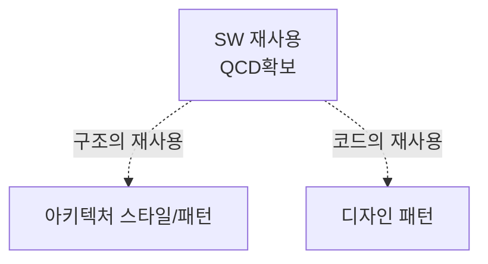
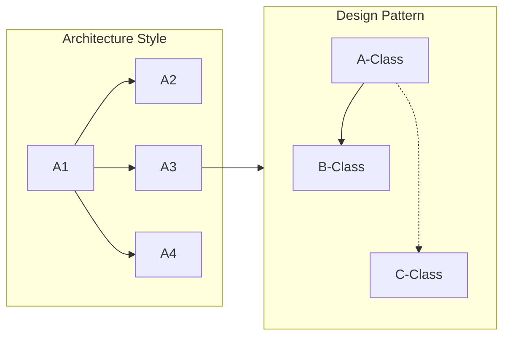

> 131

## 아키텍처스타일과 디자인패턴의 개념

- 아키텍처스타일: SW를 구성하는 서브시스템, 컴포넌트 간 관계를 분리하는 시스템 구조 스타일
- 디자인패턴: SW개발 과정에서 발견된 설계의 노하우를 재사용하기 좋은 형태로 정리한 패턴

## 아키텍처스타일, 디자인패턴의 관계도, 주요 유형

### 아키텍처스타일, 디자인패턴의 관계도

### 아키텍처스타일의 주요 유형

| 구분            | 개념도 | 비고                                                     |
| --------------- | ------ | -------------------------------------------------------- |
| MVC             | -      | M: 데이터 상태, 로직, V: 데이터 표현, C: 요청, 응답 처리 |
| 서버-클라이언트 | -      | 네트워크를 이용한 분산시스템 형태                        |
| 브로커          | -      | 브로커에게 서비스 요청시 리디렉션                        |

### 디자인패턴 주요 유형

| 구분     | 개념                                              | 비고                                  |
| -------- | ------------------------------------------------- | ------------------------------------- |
| 생성패턴 | 객체의 생성방식 결정, 클래스 정의, 구조화, 캡슐화 | Factory, Builder, Singleton           |
| 구조패턴 | 객체 조직화 방법 제시, 객체 구성에 확장성 추가    | Adaptor, Bridge, Decorator            |
| 행위패턴 | 객체 행위를 조직화, 그룹화, 객체와 클래스 연동    | Strategy, Observer, Visiter, Template |

## 아키텍처스타일, 디자인패턴 적용시 고려사항

- CBAM, ATAM을 통해 적절한 아키텍처 스타일 선택
- 디자인패턴이 적용되어있는 프레임워크 사용
