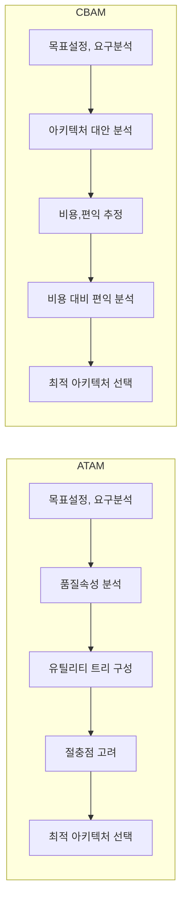

## SW아키텍처 평가모델의 개요

- 시나리오 기반에서 ==품질속성을 평가==하여 아키텍처 내부 리스크를 파악하고, ==설계타협점==을 찾는 ATAM 기법, ==경제성==까지 고려한 CBAM 평가기법으로 진화

## ATAM, CBAM의 절차, 구성요소, 적용방안

### ATAM, CBAM의 절차

- 리스크를 고려한 설게 타협안 선택, 비용대비 편익이 높은 효율안 선택.

### ATAM, CBAM의 구성요소

| 구분 | ATAM | CBAM |
| --- | --- | --- |
| 초점 | 아키텍처 품질 | 비용, 이해관계자 이익 |
| 시점 | 프로젝트 초기 | ATAM 수행 이후 |
| 평가요소 | 품질속성, 시나리오 | 비용, 편익, ROI |
| 장점 | 기존시스템 분석 용이 | 비용, 일정, 경제성 파악 |
| 단점 | 경제성 평가 미흡 | 품질속성 평가 미흡 |

### 프로젝트별 적용방안

| 구분 | ATAM | CBAM |
| --- | --- | --- |
| 대규모 시스템 | 복잡한 아키텍처 품질속성 및 트레이드 오프 분석에 효과적 | 높은 개발비용 예상시 투자 효율성 분석 용이 |
| 고가용성 시스템 | 성능, 보안 등 핵심 품질 속성 확보 용이 | 품질속성 확보를 위한 비용 효율적 아키텍처 수립 |
| 예산 제약 시스템 | 제한된 예산 내에서 최적의 아키텍처 설계 | 제한된 예산 내에서 최대 효과의 아키텍처 설계 |

- 상호보완적인 관계로 ATAM과 CBAM을 함께 사용하여, 아키텍처 설계의 기술적, 경제적 측면을 고려한 최적의 의사결정 필요
