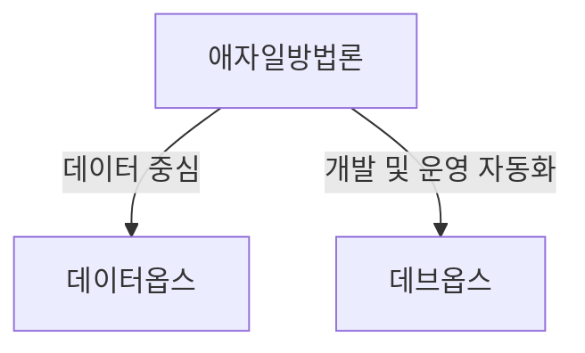
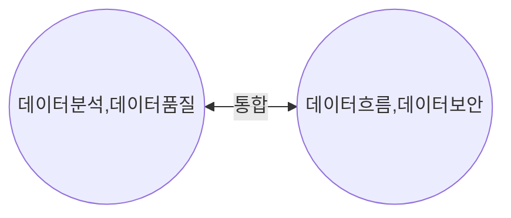
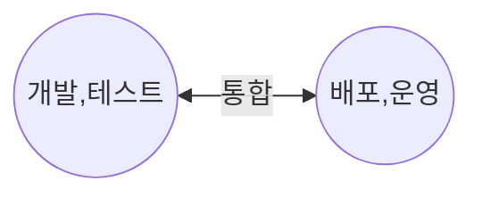

> 130

## 데이터옵스, 데브옵스 개념

- 데이터옵스: 데이터 분석/관리 프로세스에 DevOps 원칙을 적용하여 분석 처리의 효율성을 높이는 방법론
- 데브옵스: 개발과 운영을 통합하여 SW개발주기를 단축하고 품질을 향상시키는 방법론
- 데이터 요구사항, 비지니스 요구사항에 실시간으로 대응하기 위해 필요성 대두

## 데이터옵스, 데브옵스 개념도, 구성요소, 적용방안

### 데이터옵스, 데브옵스 개념도

### 데이터옵스, 데브옵스의 구성요소

| 구분 | 데이터옵스 | 데브옵스 |
| --- | --- | --- |
| 목표 | 데이터 파이프라인 자동화 | 개발, 배포, 운영 자동화 |
| 프로세스 | 데이터 수집, 저장, 처리, 분석, 시각화, 품질관리 | 계획, 개발, 빌드, 테스트, 배포, 운영, 모니터링 |
| 조직 | 데이터엔지니어, 데이터과학자, 데이터분석가, DBA | 개발자, QA엔지니어, 보안엔지니어, 시스템엔지니어 |
| 도구 | Apache Airflow, Spark | Jenkins, GitLab |
| 협업 | 기업 전체 데이터 관련 부서 | IT부서 |
| 기대효과 | 스토리지, 워크플로우, 데이터파이프라인 최적화 | 짤븡ㄴ 개발주기, 지속적 통합, 배포 |

## 데이터옵스의 추가적인 고려사항

- AI를 활용하는 MLOps로까지 확장하여, 데이터 기반의 의사결정을 더 빠르게 가져갈 수 있음.
