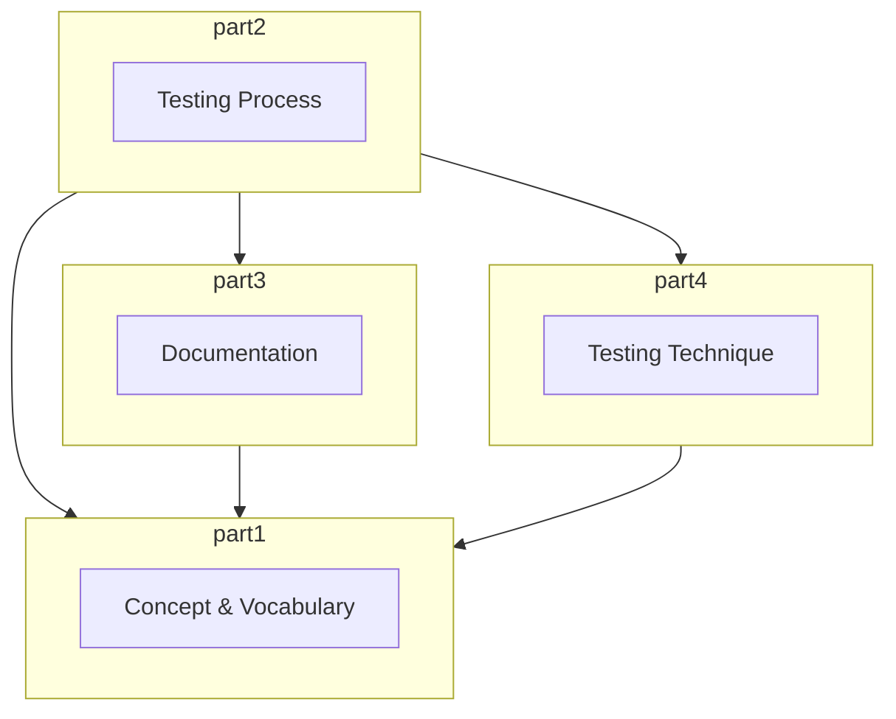
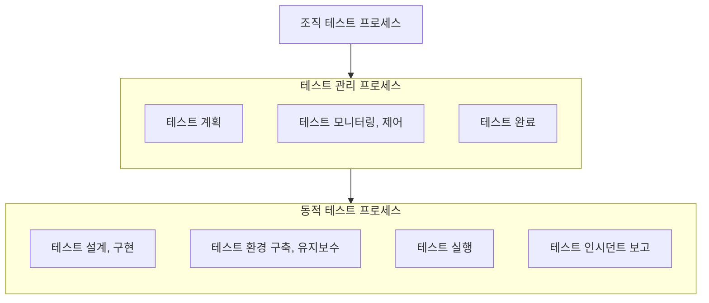
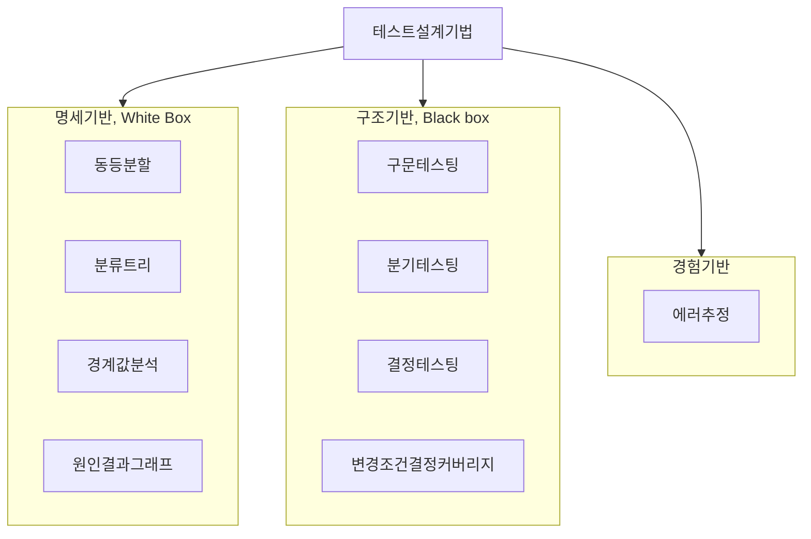

## ISO 29119 개념

- SW개발 생명주기 전 과정에 걸쳐있는 테스팅 프로세스와 관련 산출물에 대한 표준
- 요구사항명세서 기반의 명세기반 테스트 계획과, 프로그램 사양서 기반의 구조기반 테스트 계획으로 소프트웨어 품질 제고

## ISO 29119 구성요소, 프로세스, 설계기법

### ISO 29119 구성요소

- 소프트웨어 테스팅 원리, 개요, 테스팅 프로세스, 테스팅 관련문서 템플릿, 테스팅 기법으로 구성

### ISO 29119 테스팅 프로세스

- 조직 테스트의 명세 개발 및 관리, 개별테스트 단계의 테스트 관리, 특정 테스트 단계 또는 테스트 유형 내에서 동적 테스팅을 수행 관리하는 프로세스 제공

### ISO 29119 테스트 설계 기법

## 명세기반 테스트 설계기법과 품질 속성

| 기법 | 품질 속성 | 비고 |
| --- | --- | --- |
| 경계값 분석 | 기능 적합성 | 완전성, 정확성, 적절성 |
| - | 성능 효율성 | 시간 반응성, 용량성 |
| - | 사용성 | 사용자 오류 방지성 |
| - | 신뢰성 | 결함허용성 |
| - | 보안성 | 기밀성, 무결성 |
| 원인결과그래프 | 기능적합성 | 완전성, 무결성, 적절성 |
| - | 사용성 | 사용자 오류 방지성 |
| - | 호환성 | 공존성 |
| 분류트리 | 기능적합성 | 완전성, 정확성, 적절성 |
| - | 사용성 | 사용자 오류 방지성 |
| 동등분할 | 기능적합성 | 완전성, 정확성, 적절성 |
| - | 사용성 | 사용자 오류 방지성 |
| - | 신뢰성 | 가용성 |
