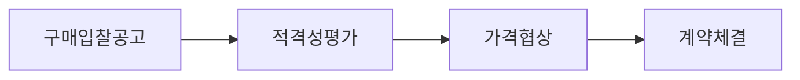

## MAS 개념

- 공공기관이 다양한 수요 충족을 위해 2인 이상(다수)을 대상으로 단가 계약을 체결하는 제도
- 조달제품 다양화로 수요기관의 선택권 확대

## MAS의 특징

- 여러 공급자와 계약을 체결하여 수요기관의 선택 폭을 확대
- 기업에게 정부조달시장 참여 기회 제공
- 업체 간 경쟁의 확대

## MAS 의 평가 절차, 항목, 2단계 경쟁

### MAS의 평가 절차

- 조달사업법 제13조 기반하여 계약 진행

### MAS의 절차 세부 항목

| 구분       | 내용               | 비고                                    |
| ---------- | ------------------ | --------------------------------------- |
| 구매공고   | 나라장터 입찰공고  | 규격확정, 상용화, 경쟁성 확보           |
| 적격성평가 | 가격 기초자료 제출 | 결격사유 확인, 협상품목대상 규격서 제출 |
| 가격협상   | 적격자와 가격 협상 | 실거래가의 가중평균, 최빈가격 기반 작성 |
| 계약체결   | 나라장터 전자계약  | 기본계약 3년                            |

- 5천만원 이상의 경우 2단계 경쟁으로 투명성, 경쟁성 강화

### MAS 2단계 경쟁 제도

| 구분         | 내용                                    | 비고                        |
| ------------ | --------------------------------------- | --------------------------- |
| 대상         | 1회 구매애정 금액 5천만원 이상          | 중소기업제품은 1억 이상     |
| 기본평가항목 | SW특성 반영한 기본 평가항목             | 가격, 기능성, 사용성        |
| 선택평가항목 | 유지보수 상품 등록, 국산SW 우대 등 반영 | 유지관리성, 혁신 우수성     |
| 예외사항     | 본상품 구매에 따른 제외 범위            | 유지관리, 계속계약, 증설 등 |

## 제3자 단가계약과 MAS차이점

| 구분          | 제3자단가계약              | 다수공급자계약                                                     |
| ------------- | -------------------------- | ------------------------------------------------------------------ |
| 계약방법      | 수의                       | 경쟁                                                               |
| 계약수량      | 업체계약수량               | 업체계약수량                                                       |
| 계약자        | 단일업체                   | 다수업체                                                           |
| 가격자료      | 동일품목 3건 이상 구매실적 | 규격별 최근 1년간 전자세금계산서 유사 거래 실적                |
| 2단계 경쟁    | 없음                       | 1회 구매예정 일정금액 이상                                         |
| 납품업체 선정 | 수요기관 지정              | 일정금액 미만 수요기관 지정 일정금액 이상 2단계 경쟁 통한 평가 |

## 참조

- [조달청: MAS 다수공급자계약](https://www.pps.go.kr/kor/bbs/list.do?key=01337)
