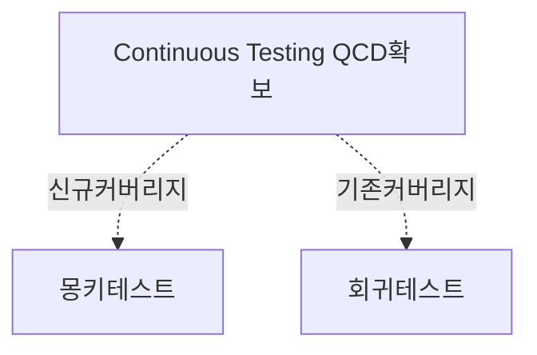
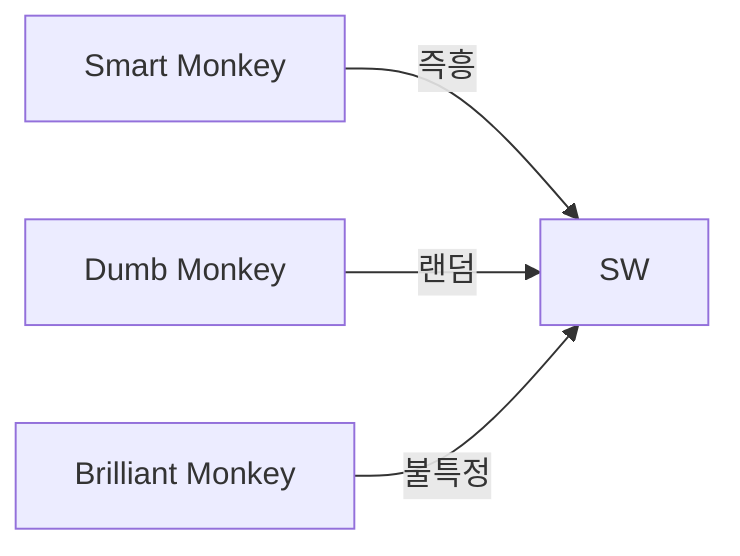
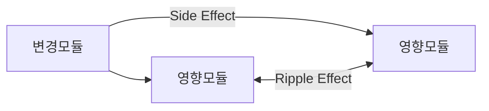

> 129

## 몽키테스트, 회귀테스트 개요

### 몽키테스트와 회귀테스트 개념

### 몽키테스트와 회귀테스트 배경

- 애자일 개발 방법론 도입으로 소프트웨어의 잦은 변경으로 인하여 자동화되고 연속적인 테스트의 필요성이 증가.
- 기존 테스트로를 지속하면 살충제 패러독스가 발생하므로, 새로운 버그 발견을 위해 몽키테스트 실행.

## 몽키테스트와 회귀테스트 개념도, 구성요소

### 몽키테스트와 회귀테스트의 개념도

- 테스트케이스나 시나리오 없이 예측할 수 없는 방식으로 무작위 테스트

- 코드, 기능 변경 후 기존 기능이 정상적으로 동작하는지 테스트

### 몽키테스트와 회귀테스트 구성요소

| 구분 | 몽키테스트 | 회귀테스트 |
| --- | --- | --- |
| 목적 | 예기치 못한 버그 발견 | 기존 기능 동작 확인 |
| 방식 | 무작위 입력, 스트레스, 랜덤 클릭 | 기존 테스트케이스 재실행 |
| 시기 | 주로 시스템테스트 단계 | 통합, 시스템, 인수테스트 변경시 |
| 완료 | 오류 미검출 | 사이드이펙트 수정 완료 |
| 장점 | 예상치 못한 행동 시뮬레이션 | SW안정성 유지 |
| 단점 | 재현 어려움, 비일관성 | 살충제 패러독스 |

## 통합테스트 계획시 포함할 주요사항

- 시스템 목적, 범위
- 대상시스템 구조
- 테스트 자원, 일정
- 시작 및 종료 조건
- 테스트 시나리오
- 테스트 방법 및 절차 교육
