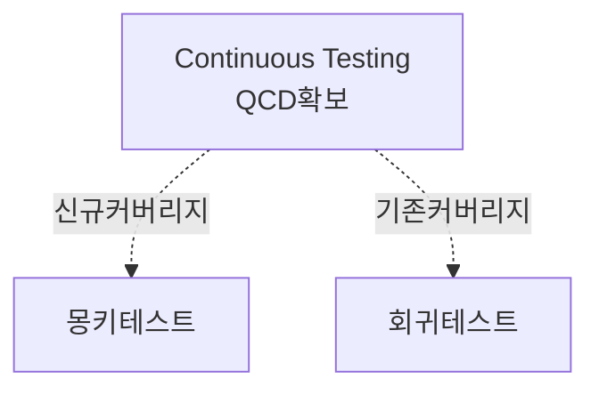

## I. 개요

### 개념

### 배경

애자일 개발 방법론 도입으로 소프트웨어의 잦은 변경으로 인하여 자동화되고 연속적인 테스트의 필요성이 증가.

기존 테스트로를 지속하면 살충제 패러독스가 발생하므로, 새로운 버그 발견을 위해 몽키테스트 실행.

## II. 몽키테스트와 회귀테스트 비교

가. ~의 구조 (구성도, 개념도)
나. ~의 핵심요소
가.에 그린 다이어그램을 3단 표로 작성

| 구분 | 내용 | 비고 |
| ---- | ---- | ---- |
| -    | -    | -    |

## 다. ~의 적용방안

| 구분          | 내용 | 비고 |
| ------------- | ---- | ---- |
| 비지니스 관점 | -    | -    |
| 기술 관점     | -    | -    |
| 보안 관점     | -    | -    |

## 기출

- 129/4/4
