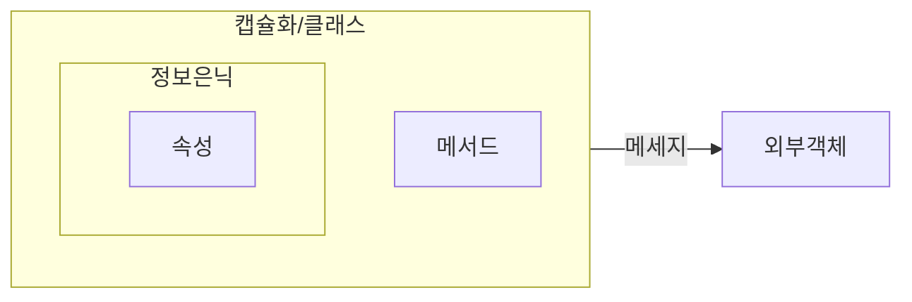

## 객체지향방법론의 개념

- SW 생명주기에 객체지향 개념을 접목시켜 객체를 중심으로 시스템을 모델링하는 방법론
- 캡슐화, 추상화, 상속, 다형성과 정보은닉을 통해 복잡성을 줄이고, 재사용성과 유지보수성을 극대화하여 비용 절감

## 캡슐화, 정보은닉의 개념도, 비교, 적용방안

### 캡슐화와 정보은닉 개념도

- 캡슐화는 정보은닉을 실현하기 위한 수단으로 활용

### 캡슐화와 정보은닉 비교

| 구분 | 캡슐화                                       | 정보은닉                        |
| ---- | -------------------------------------------- | ------------------------------- |
| 개념 | 객체의 속성과 메소드를 하나의 단위로 묶는 것 | 객체 내부 구현을 감추는 것      |
| 목적 | 응집도와 모듈성 향상                         | 내부 상태 보호, 변경용이성 확보 |
| 수단 | 접근제어자, 접근메소드                       | 접근제어자, 인터페이스          |
| 효과 | 모듈화, 재사용성                             | 안정성, 유지보수성              |

### 캡슐화, 정보은닉 적용방안

| 구분     | 캡슐화                       | 정보은닉                   |
| -------- | ---------------------------- | -------------------------- |
| 설계단계 | 클래스 책임 분배, 접근제어자 | 모듈화, 추상화, 레이어설계 |
| 구현단계 | getter/setter, 생성자        | 의존성 주입, 디자인패턴    |

## 객체지향 프로그래밍 고려사항

- SOLID 원칙 준수, GoF의 디자인패턴 활용, 낮은 결합도, 높은 응집도를 가진 클래스, 모듈 구현
