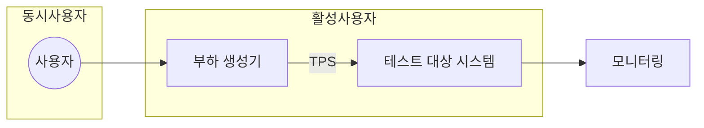

## 성능테스트의 개념

- 시스템의 ==비기능 요구사항==을 만족하는지 확인하기 위해 실제 환경과 비슷한 환경에서 수행하는 테스트
- 시스템 안정성 확인, 사용자 경험 개선, 비용 절감, 확장성 검증

## 성능테스트 구성도, 구성요소, 주요 지표

### 성능테스트 구성도

- 테스트 시나리오를 작성 후 부하생성, 모니터링 및 분석 후 시스템에 추가 반영

### 성능 테스트 구성요소

| 구분 | 내용 | 비고 |
| --- | --- | --- |
| 부하 생성기 | 시나리오를 기반으로 시스템에 부하를 발생시키는 도구 | JMeter, LoadRunner |
| 모니터링, 분석 도구 | 시스템 성능 지표 실시간 모니터링, 테스트 결과 분석, 성능 문제 식별 | New Relic, ELK Stack |

### 성능 테스트 주요 지표

| 구분 | 지표 | 내용 |
| --- | --- | --- |
| 테스트환경 | 동시사용자 | 성능테스트의 가상사용자 수 |
| - | 활성사용자 | 서버에 연결되어 요청을 처리 중인 사용자로 트랜잭션 발생 사용자 |
| 성능 | 응답시간 | 요청 후 응답이 완료되어 사용자 화면에 출력될 때까지 시간 |
| - | 대기시간 | 하나의 요청에 응답을 수신하고 다음 요청을 보낼 때까지의 시간 |
| - | TPS | 단위 시간 당 서버, DB에서 처리된 요청 수 |

## TPS 계산

> Little's Law
$$
  CU = \lambda * W
$$

- 동시사용자 = TPS * (Request Time + Think Time)
- 웹 시스템에선 동시 사용자와 활성사용자 간 차이가 있으므로 TPS 가정 하에 활성 사용자 계산
