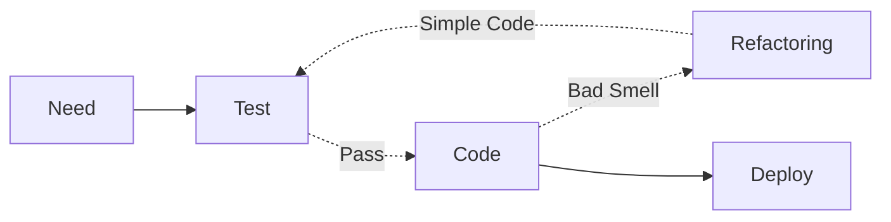

## I. 개요

### 개념

외부적 기능은 수정하지 않고, 내부를 단순화하여 유지보수성을 향상시키는 기법

### 배경

애자일 개발 방법론의 도입으로 TDD를 기반으로 코드스멜을 제거하기 위한 리팩토링의 중요성이 강조됨.

## II. 리팩토링의 핵심요소, 적용방안

### 가. 리팩토링의 구조 (구성도, 개념도)

### 나. 리팩토링의 핵심요소

가.에 그린 다이어그램을 3단 표로 작성

| 구분 | 내용 | 비고 |
| ---- | ---- | ---- |
| -    | -    | -    |

### 다. 리팩토링의 적용방안

| 구분          | 내용 | 비고 |
| ------------- | ---- | ---- |
| 비지니스 관점 | -    | -    |
| 기술 관점     | -    | -    |
| 보안 관점     | -    | -    |

## 기출

- 129/2/6
