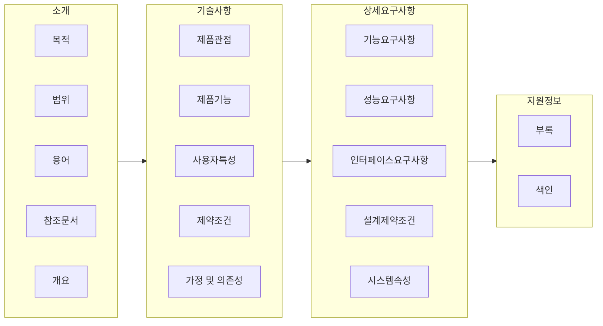

## 요구사항 명세서 개념

- SDLC 전 단계에서 검토, 승인, 평가의 기준이 되는 SW가 갖추어야할 기능, 성능, 제약조건 등이 기술된 명세서
- 요구사항의 애매모호성을 제거하고, FP가 도출 가능한 수준까지 작성하여 의사소통 비용절감 및 변경관리용이성 증대를 위해 필요.

## 요구사항 명세서의 구성도, 핵심요소, 활용방안

### 요구사항 명세서의 구성도

### 요구사항 명세서 핵심요소

| 구분               | 내용                                                      | 비고                   |
| ------------------ | --------------------------------------------------------- | ---------------------- |
| 기능요구사항       | 시스템이 수행할 기능, 제공해야할 서비스 요구사항          | 사용자 관점            |
| 성능요구사항       | 시스템 속도, 처리량, 응답시간 등 시스템 성능 요구사항     | 측정가능한 구체적 수치 |
| 인터페이스요구사항 | 외부시스템 연동, 하드웨어와 상호작용 방식에 대한 요구사항 | 데이터 포맷, 프로토콜  |
| 설계 제약조건      | 시스템 설계, 구현에 제약을 가하는 요소 설명               | 개발환경, 표준 준수    |

### 요구사항 명세서 활용방안

| 구분     | 내용                               | 비고               |
| -------- | ---------------------------------- | ------------------ |
| 설계     | 시스템 아키텍처, 인터페이스, UI/UX | 요구사항 충족 설계 |
| 구현     | 코딩, 단위테스트 기준              | 기능 요구사항 준수 |
| 테스트   | 테스트케이스 설계, 요구사항 검증   | 결함 문서화        |
| 유지보수 | 변경관리, 사용자 교육, 개선        | 피드백 반영        |

## 요구사항 명세서 작성시 고려사항

- 명확하고 일관된 용어를 사용하여 이해관계자 간 의사소통의 투명성 제고
