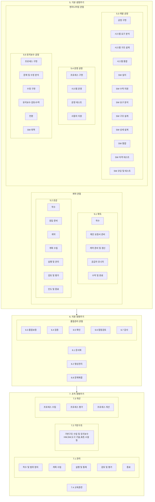

## ISO 12207 개요

### ISO 12207 개념

- 소프트웨어 생명주기 프로세스를 위한 국제표준으로, SW개발 및 유지보수를 관리하는 구조화된 프레임워크 제공

### ISO 12207 필요성

- 조직이 SW를 효율적으로 개발하고 품질 표준을 충족하도록 하여 리스크를 줄이고 프로세스를 개선하는데에 필요

## ISO 12207 구성도, 구성요소, 적용방안

### ISO 12207 구성도

### ISO 12207 구성요소

| 구분          | 내용                                   | 비고                                    |
| ------------- | -------------------------------------- | --------------------------------------- |
| 기본 생명주기 | SW 개발의 주요 단계를 나타냄           | 획득, 공급, 개발, 운영, 유지보수        |
| 지원 생명주기 | 기본 생명주기를 지원하는 활동          | 문서화, 구성 관리, 품질 관리, 문제 해결 |
| 조직 생명주기 | 조직의 성숙도 및 역량 강화를 위한 활동 | 관리, 기반 구조, 개선, 교육 훈련        |

### ISO 12207 적용방안

| 구분       | 내용                  | 비고                                                        |
| ---------- | --------------------- | ----------------------------------------------------------- |
| 리더       | 전략 수립 및 지원     | 도입 필요성 공유, 예산 확보 및 지원, 결과 검토, 지속적 지원 |
| 매니저     | 프로세스 구축 및 실행 | 표준 프로세스 조정, 상세 절차 수립, 결과 분석 및 개선       |
| 오퍼레이터 | 실무 적용 및 개선     | 표준 프로세스 준수 및 실무 적용, 교육 참여, 개선 제안       |

## ISO 12207 고려사항

- 조직 내 새로운 프로세스 도입에 대한 구성원들의 저항을 최소화하고, 적극적인 참여를 유도하기 위한 변화 관리 전략 필요
