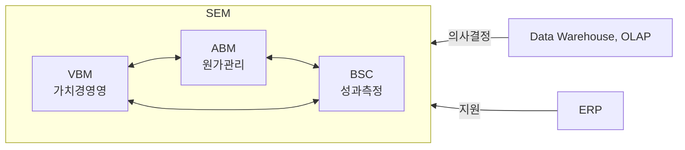

## SEM 개념

- 기업 경영진의 ==가치중심경영==을 전사적으로 구현하기 위해 ==원가, 성과관리==를 통해 ==전략 중심의 조직==을 구현하기 위한 ==경영지원시스템==
- 가치중심경영, ERP의 경영지원 한계점, 신속한 의사결정 지원, ESG 연계를 통한 기업의 연속성 제고

## SEM 구성도, 구성요소, 적용방안

### SEM 구성도

- 전사적 연계를 통한 신속한 의사결정 지원

### SEM 구성요소

| 구분 | 내용 | 비고 |
| --- | --- | --- |
| ==VBM== | 가치중심 과제 관리, 투자 이익평가 | KPI 중심, 현금 흐름 창출 |
| ==ABM== | 원가 관리, 자원 배분 관리 | 가격 결정, 의사 결정, 원가 분석, 프로세스 개선 |
| ==BSC== | 기업 성과 관리, 경영 품질 모니터링 | ==재무, 고객, 내부프로세스, 학습 관점==, IT BSC 연계 |

> 재고내학, 기사운미

- 기존 현황 파악, 실적 관리를 위한 의사결정시스템 구축 필요

### SEM 시스템 적용방안

| 구분 | 방안 | 비고 |
| --- | --- | --- |
| 자료 수집, 분석 | 대상 범위 명확화, 데이터 통합 분석 구현 | SWOT, PEST, 3C 기법 통한 내외부 정보 수집 |
| 핵심가치 관리 | 종합적 성과관리 체계 구축, KPI 기반 보상체계 구축 | IT BSC |
| 의사결정 실행 | 실행 조직 구성, 프로세스 개선, 성과측정, 평가 | 성과 피드백, 보상, 지속적 개선 |

## SEM 추가적인 고려사항

- 가치경영 도입 및 사회적 책임에 대한 경영 방식을 결합하여 기업의 경쟁력 제고
- RE100 달성을 위한 기업 내 전략 수립 필요
