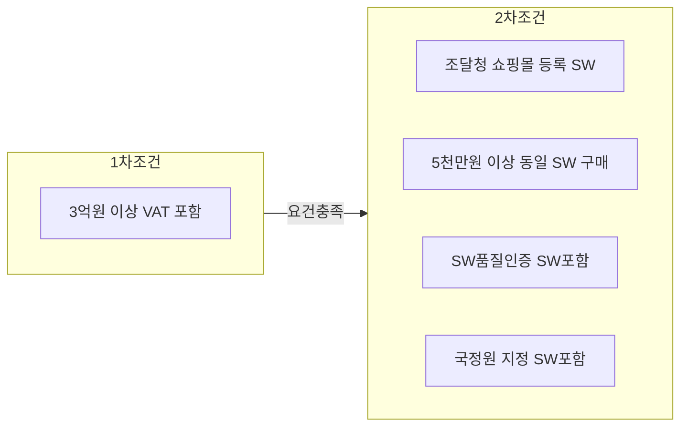

## 상용SW 직접구매제도 개념

- 발주기관이 공공정보화사업 추진 시 상용SW만을 별도 발주, 평가, 산정, 계약하는 방식으로 직접 구매하는 것을 말하는 구 분리발주제도
- 정보시스템 품질향상, SW업체 경쟁력, 분리발주 여건 성숙을 위해 필요

## 상용SW 직접구매제도 적용대상, 예외기준

### 상용SW 직접구매제도 적용대상

- 1차 조건 충족시, 2차 조건 중 하나라도 해당되는 경우 상용SW 직접구매 대상

### 상용SW 직접구매제도 예외기준

| 구분                         | 내용                 | 비고                       |
| ---------------------------- | -------------------- | -------------------------- |
| SW진흥법 제40조              | 민간투자형 SW사업    | 공공, 민간 협력 추진 사업  |
| 국가계약법 시행규칙 84조 2항 | 정보시스템 통합 불가 | 새 정보시스템과 통합 불가  |
| -                            | 현저한 비용상승      | 통합불가거나 비용상승 초래 |
| -                            | 현저한 지연 우려     | 사업기간 내 완성 불가      |
| -                            | 현저한 비효율        | 직접구매시 비효율          |

- 예외된 경우, 조달청 또는 상위기관에 "미리검토" 요청 필요

## 상용SW 직접구매와 일괄발주 비교

| 구분         | 상용SW 직접구매                         | 일괄발주                                                          |
| ------------ | --------------------------------------- | ----------------------------------------------------------------- |
| 개념         | 일괄발주형태에서 SW구매만 별도 분리발주 | SW사업 추진시 HW,SW,시스템 통합 등 사업에 필요한 상용SW 포함 발주 |
| 법률         | SW진흥법 제54조                         | 국가계약법 시행령                                                 |
| 사업발주     | 상용SW 구매사양서 포함                  | 제안요청서                                                        |
| -            | 직접구매대상 상용SW 구매계획            | -                                                                 |
| 평가 및 계약 | SW별 개별공고, 개별평가 계약            | 일괄 평가 계약                                                    |
| -            | 조달청 쇼핑몰 구매 계약                 | -                                                                 |
| 계약자       | 복수 계약자                             | 단일 주 계약자                                                    |

- 경쟁 입찰 통해 직접구매 대상 상용SW 제품 중 구매 금액 1억 이상 상용 SW는 BMT 대상

## BMT 수행 시 고려사항

- 구매 금액 1억 이상 상용SW는 BMT를 직접 시행하거나 시험기관에 대행의뢰하여 기술성을 평가해야함.
- 시스템SW, 개발용SW, 응용SW로 구분하여 성능 시험 필요.
