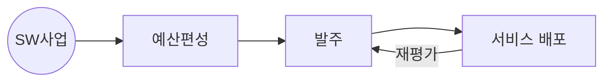

## SW사업 영향평가 개념

- 국가 SW사업의 예산 편성, 발주, SW 배포 및 서비스를 추진하는 경우, ==민간 SW 산업 생태계에 미치는 영향을 검토하여 사전 조정==하는 제도
- 민간 SW시장 침해 예방, 민간 SW기업 경쟁력 확보, 공공-민간 중복개발 및 경쟁 방지, 예산 절감

## SW사업 영향평가 절차도, 세부절차, 평가항목

### SW사업 영향평가 절차도

### SW사업 영향평가 세부절차

| 구분 | 내용 | 비고 |
| --- | --- | --- |
| 1단계 | SW사업 기본정보 작성 | 사업명, 주요내용, 사업기간 |
| 2단계 | 운영계획 검토 | 운영기관 또는 사용자와의 공동 사용여부 분석 |
| 3단계 | 민간 SW시장 침해가능성 검토 | 동일, 유사 SW 존재 여부 확인 |
| 4단계 | 사업 필요성, 공공성 검토 | 유사 민간 SW 있으나 추진하는 사유 |
| 5단계 | 종합의견 작성 | 민간 SW 시장침해 가능성 종합 판단 |

### SW사업 영향평가 평가항목

| 구분 | 요소 | 내용 |
| --- | --- | --- |
| 평가기준 | 민간SW시장 침해 가능성 | SW사업 주요기능과 동일, 유사한 SW를 민간에서 제공하는지 여부 |
| - | SW사업 필요성, 공공성 | 민간 SW가 있지만, 사업을 추진해야하는 이유 |
| 평가방법 | 자체평가 | 사업부서에서 직접 검토 |
| - | 기술지원 | 과기정통부, 정보통신산업진흥원 지원 요청 |

## SW사업 영향평가 검토시 고려사항

- OpenAPI 등을 통한 공공 데이터 개방으로 사업을 통한 민간 서비스 시장 활성화 기여 필요
