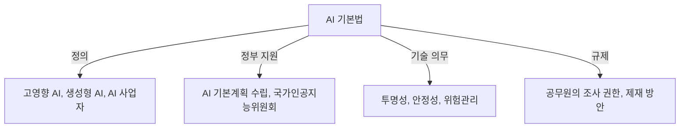

## AI 기본법 개념

- 인공지능 기술의 발전과 신뢰성 확보를 목표로, AI 관련 법적·제도적 기반을 마련하는 법률

### AI 기본법 목적

- AI 기술의 윤리적·사회적 문제 해결
- 고영향 AI와 생성형 AI의 안전성·투명성 확보
- 산업 발전과 규제 간 균형 유지

### AI 기본법 제정 필요성

- 기술 발전 가속화: AI 기술이 급격히 발전하면서 사회적 위험(편향성, 개인정보 침해 등) 증가
- 글로벌 규제 동향: EU AI Act, 미국 행정명령 등 해외 주요국의 AI 법제화에 따른 국내 대응 필요
- 산업 경쟁력 강화: AI 산업 육성을 위한 법적·제도적 지원 체계 마련

## AI 기본법 구성도, 핵심요소, 활성화방안

### AI 기본법 구성도

### AI 기본법 핵심요소

| 구분   | 내용 | 비고 |
| --- | --- | --- |
| 용어 정의 | 고영향 AI, 생성형 AI, 인공지능사업자 등 법적 정의 | 의료, 금융, 교통 등 적용 |
| 정부 지원 | 국가인공지능위원회 설치, AI 기본계획 수립 | 3년마다 계획 수립 |
| 기술 의무 | 투명성·안정성 확보, 영향 평가, 위험 관리 체계 구축 | 고영향 AI 중심 |
| 대리인 제도 | 해외 기업의 국내 대리인 지정 의무 | 미지정 시 과태료 부과 |
| 조사 권한 | 공무원의 자료 제출 요구, 조사 및 처분 권한 | 불이행 시 과태료 부과 |

## AI 기본법, EU AI Act 비교

| 구분 | AI 기본법 | EU AI Act |
| --- | --- | --- |
| 법률 목적 | AI 기술 발전 및 신뢰성 확보 | AI 위험 관리 및 책임 강화 |
| 규제 대상 | 국내 기업 및 기관 | EU 내 모든 AI 시스템 |
| 규제 방식 | 고영향 AI, 생성형 AI 중심 | 4단계 위험 기반 규제 적용 |
| 고위험 AI 관리 | 국방,의료,금융 등 일부 규제 | 고위험 AI 사전 승인 필수 |
| 생성형 AI 규제 | AI 생성물 표시 의무 | 저작권 보호, 데이터 출처 공개 |
| 산업 육성 | R&D 지원, 스타트업 육성 | 규제 중심, 기업 책임 강화 |
| 국제 협력 | EU, 미국과의 정합성 확보 | 글로벌 표준 제시 |

## AI 기본법 기대효과

| 구분 | 내용 | 비고 |
| --- | --- | --- |
| 산업 육성 | AI 연구개발(R&D) 지원, 데이터·컴퓨팅 인프라 확충 | 글로벌 경쟁력 강화 |
| 신뢰성 확보 | 투명성·안정성 확보, 고영향 AI 및 생성형 AI 오남용 방지 | 국민 신뢰성 향상 |
| 국제 정합성 | EU, 미국 등 주요국과의 AI 규제 프레임워크 정합성 확보 | 글로벌 표준 준수 |
| 향후 과제 | 유연한 가이드라인 마련, 산업 성장과 규제 균형 유지 | 국제 협력 강화 필요 |
| 미래 전망 | AI 기술 발전 속도에 맞춘 법적 대응, 글로벌 AI 산업 주도 | 한국의 선도적 역할 기대 |
