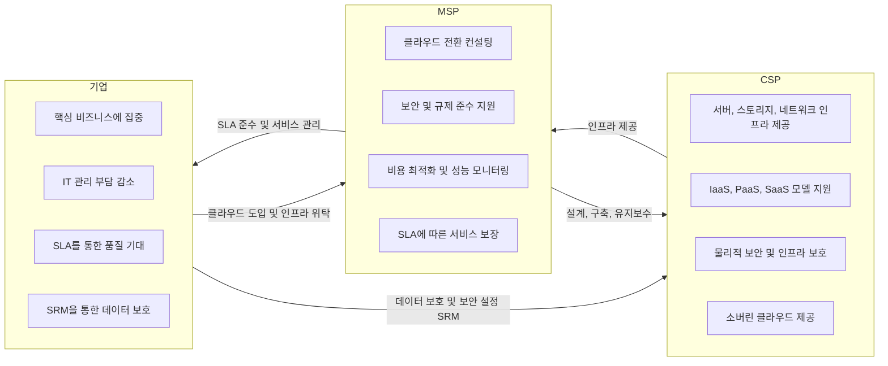

## 클라우드 아웃소싱 개념

- 기업이 IT 인프라, 소프트웨어, 데이터 관리 등 다양한 IT 업무를 외부의 클라우드 서비스 제공자(CSP)나 관리형 서비스 제공자(MSP)에게 위탁하는 방식
- 비용 절감, 확장성, 유연성, 보안성, 위험 관리

## 클라우드 아웃소싱 개념도, 구성요소, 적용방안

### 클라우드 아웃소싱 개념도

- 책임공유모델(SRM)과 서비스수준 계약(SLA)을 통해 각 주체가 수행하는 역할을 규정하고, 안정적인 클라우드 서비스 운영

### 클라우드 아웃소싱 구성요소

| 구분 | 내용 | 비고 |
| --- | --- | --- |
| CSP | 서버, 스토리지, 네트워크 인프라 및 다양한 클라우드 서비스 모델(IaaS, PaaS, SaaS) 제공 | AWS, Microsoft Azure 등 |
| MSP | 클라우드 설계, 구축, 보안 관리 및 유지보수를 지원하며, 규제 준수와 최적화 서비스 제공 | 메가존클라우드, 베스핀글로벌 등 |
| 기업 | 클라우드를 도입해 핵심 비즈니스에 집중하고, IT 인프라 관리 부담 감소 | SRM을 통한 보안 설정 관리 |

### 클라우드 아웃소싱 적용 방안

| 구분 | 내용 | 비고 |
| --- | --- | --- |
| CSP 및 MSP 선택 | 비즈니스 요구사항에 맞는 CSP와 MSP를 선택하여 SLA로 서비스 품질을 보장 | 글로벌/국내 CSP 선택 |
| 클라우드 전환 전략 | MSP와 협력하여 장기적인 디지털 전환 전략을 수립하고 데이터 마이그레이션 및 교육을 진행 | 단계별 전환 계획 |
| 보안 및 규제 준수 | SRM을 통해 보안 책임을 명확히 하고, MSP의 컨설팅을 통해 규제 준수 체계를 마련 | 금융, 의료 등 규제 엄격한 산업에 필수 |
| 비용 최적화 | MSP의 성능 모니터링 및 최적화 방안을 통해 불필요한 자원 낭비 없이 비용 효율성을 확보 | 성능 모니터링으로 시스템 가용성 유지 |
| 지속적 개선 | MSP와 협력하여 최신 기술 업데이트와 최적화 작업을 지속적으로 수행하여 경쟁력을 유지 | 주기적 리뷰 및 개선 |
| SLA 관리 | SLA를 통해 가용성, 응답 시간, 문제 해결 시간 등 서비스 수준을 보장하고, 위반 시 보상 조건 설정 | 크레딧, 환불 등의 보상 가능 |
| 소버린 클라우드 활용 | 데이터 주권과 국가별 규제를 준수하며, 소버린 클라우드를 활용해 특정 국가 내 데이터 저장 및 처리 | 법적 규제가 엄격한 산업 필수 |

## 클라우드 아웃소싱 유형

| 구분 | 내용 | 이점 |
|---|---|---|
| 전체 클라우드 아웃소싱 | IT 서비스 전체를 클라우드로 이전 | 핵심 비즈니스 집중 |
| 선택적 클라우드 아웃소싱 | IT 서비스 중 일부만 클라우드로 이전하여 특정 기능이나 업무를 CSP 또는 MSP에 위탁하는 방식 | 관리 효율성 향상 |
| SI + 클라우드 아웃소싱 | 시스템 통합(SI) 후 운영을 위한 클라우드 아웃소싱을 통해 구축과 운영을 외부 서비스 제공자에게 위탁하는 방식 | 안정적이고 유연한 운영 가능 |
