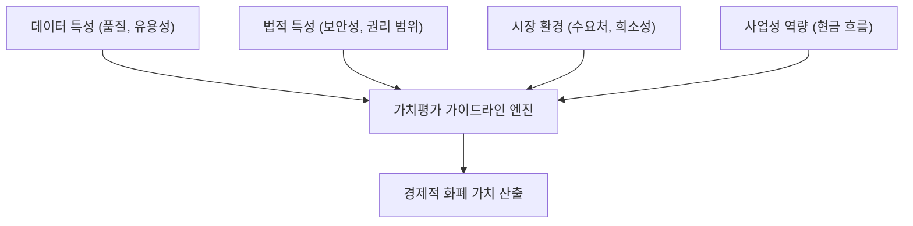

## 데이터 가치평가 및 데이터 자산화의 개요

### 데이터 가치평가 및 데이터 자산화의 개념
- **데이터 가치평가:** 데이터산업법에 의거, 대상 데이터의 활용을 통해 창출할 수 있는 경제적 가치를 가치평가 방법론을 적용하여 ==정량적 화폐가치==로 산정하는 체계.
- **데이터 자산화:** 기업 내 고립된 데이터를 단순 정보(Information) 수준을 넘어 비즈니스 가치를 반복 창출할 수 있는 ==경영 전략 자산(Asset)==으로 정의, 관리, 운용하는 일련의 과정.

### 데이터의 자산적 가치 창출 배경 (필요성)
- **자금 조달 다변화:** 디지털 자산화 도래에 따라 데이터를 담보로 한 금융 보증, 대출 및 투자 유치 활성화.
- **데이터 비즈니스 모델 구축:** 데이터 거래소 활성화에 따른 라이선싱 가격 산정 표준 기준 요구.

## 데이터 가치평가의 개념과 가치평가 방법론

### 데이터 경제적 가치평가 체계도

### 데이터 가치평가의 3대 방법론 비교
| 구분 | 수익접근법 (Income Approach) | 원가 및 시장접근법 (Cost/Market) |
| :--- | :--- | :--- |
| **개념** | 데이터 활용으로 인한 미래 기대 수익을 현재 가치로 할인 | 생성에 소요된 비용 또는 시장 거래 사례 기반 산정 |
| **평가 대상** | 사업적 완성도가 높고 현금 흐름 예측이 가능한 데이터 | 거래 사례가 존재하거나 대체 구축 비용 산정이 용이한 데이터 |
| **핵심 원리** | DCF법 및 데이터 기여율($DR$) 반영: $V = \sum_{t=1}^{n} \frac{CF_t \times DR_t}{(1 + r)^t}$ | - 대체원가 계산 (역사적 원가 적용) - 유사 거래 사례 비교 (배수법 적용) |
| **주요 한계** | 미래 현금 흐름 및 데이터 기여율의 임의 추정 위험성 | 데이터 독창성으로 인한 거래 사례 부재, 미래 가치 미반영 |

## 데이터 자산화의 개념과 핵심요소 및 라이프사이클

### 데이터 자산화의 개념 및 거버넌스 체계
- 데이터를 자산화하기 위해서는 데이터의 품질, 표준, 메타데이터를 통합 관리하는 **데이터 거버넌스(원칙, 조직, 프로세스)** 체계가 전제되어야 함.

### 데이터 자산화의 핵심 구성요소 및 라이프사이클
| 구분 | 핵심요소 및 라이프사이클 | 세부 설명 및 산출물 |
| :--- | :--- | :--- |
| **가치 식별** | 데이터 가치평가 체계 | 비즈니스 관련성 분석을 통해 자산화 대상 코어 데이터 선별 |
| **구조화** | 데이터 제품화 (Data Product) | 실무자가 즉시 활용 가능하도록 API, 대시보드 형태로 패키징 |
| **관리 통제** | 데이터 카탈로그 및 계보 | 메타데이터 기반 리니지(Lineage) 관리로 투명성과 품질 보장 |
| **주기 관리** | 데이터 라이프사이클 | 생성 ➡️ 저장 ➡️ 분석 ➡️ 활용 ➡️ 아카이빙/폐기의 단계별 통제 |

## 데이터 가치평가 및 데이터 자산화의 활용사례 및 고려사항

### 데이터 가치평가 및 자산화의 실무적 활용사례
| 구분 | 내용 (활용 분야) | 비고 (실제 사례) |
| :--- | :--- | :--- |
| **금융 및 보증** | 데이터 담보 보증서 발급 및 보증 대출 | 신용보증기금, 기술보증기금 주도의 가치평가 연계 금융 지원 |
| **자산 및 매각** | 기업 M&A 및 투자 유치 시 자산 가치 평가 | 기업 보유 독점 데이터의 가치를 기업가치(Valuation)에 합산 |
| **거래 및 중개** | 데이터 거래소 기반 데이터 판매 및 라이선싱 | 금융·교통·통신 분야 이종 데이터 결합 및 API 판매 거래 |

### 성공적인 데이터 자산화를 위한 고려사항
- **컴플라이언스 준수:** 개인정보보호법에 의거, 가명 정보 처리 및 개인 식별 방지 필터링을 통해 법적 안정성을 확보해야 함.
- **데이터 리터러시 내재화:** 조직 전반이 데이터를 이해하고 분석·활용할 수 있는 CDO 중심의 역량 내재화 프로세스가 결합되어야 실현
