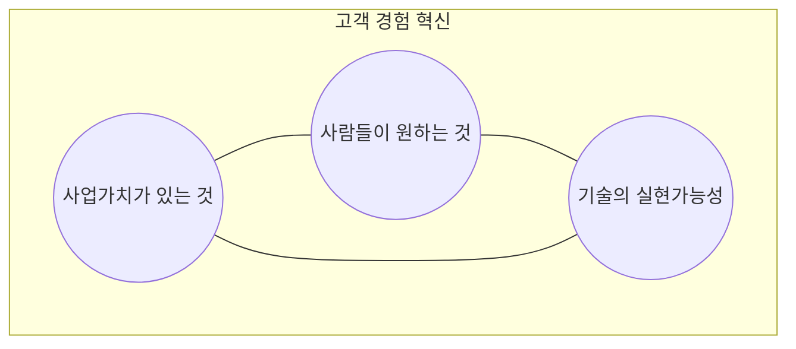
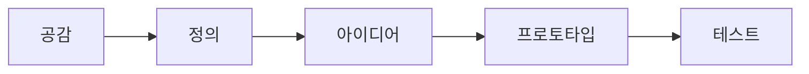

## 디자인 씽킹 개념

- 디자이너가 생각하는 방식으로 문제를 찾아 해결하는 과정에서의 태도와 생각하는 절차 및 방법

## 디자인 씽킹 핵심요소, 프로세스, 적용방안

### 디자인 씽킹 핵심요소

- 사람들이 원하는 것, 기술적으로 가능한 것, 사업가치가 있는 것을 활용하여 고객 경험 혁신을 위한 전략 도출

### 디자인 씽킹 프로세스

| 구분 | 내용 | 비고 |
| --- | --- | --- |
| 공감 | 사용자 관찰을 통해 요구와 문제를 파악하는 단계 | 인터뷰, 설문조사 |
| 정의 | 파악한 문제 기반 핵심 문제 정의 | 의견 조율, 정의서 작성 |
| 아이디어 | 다양한 해결책 모색, 가장 유망한 아이디어 선정 | 브레인스토밍, 아이디어 스케치 |
| 프로토타입 | 아이디어 구현, 시각화 | 저비용 프로토타이핑 |
| 테스트 | 프로토타이핑 테스트, 피드백, 개선 | 반복적 테스트, 사용성 테스트 |

### 디자인씽킹 적용방안

| 구분 | 내용 | 비고 |
| --- | --- | --- |
| 데이터분석 | 사용자 행동 분석, 서비스 요구사항 도출 | 데이터 경량화 |
| UI/UX 디자인 | 사용자가 쉽게 사용할 수 있는 인터페이스, 기능 설계 | 사용자 중심 설계 |
| SW 개발 | 사용자 요구사항 반영 SW 기능 개발, 클래스 설계 | 사용자 피드백 반영 |
| 유지보수 | 사용자 피드백을 반영하여 지속적인 서비스 개선 | 반복적 개선 |

## 디자인씽킹 고려사항

- 반복적으로 문제를 정의하고 분석, 개선해나가기 위해 실패를 학습의 기회로 삼고 새로운 시도를 하는 조직문화 조성 필요
