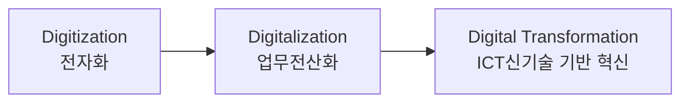
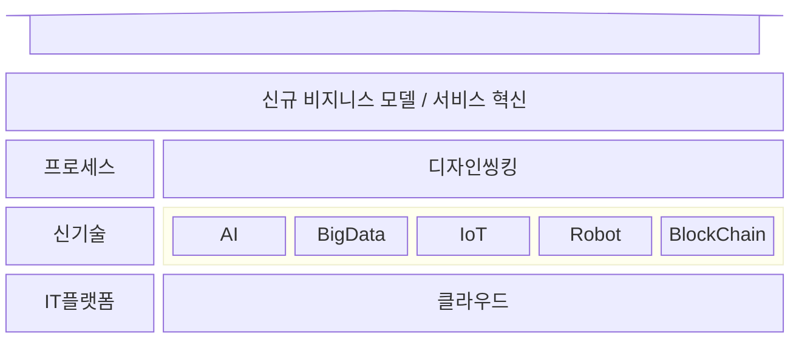

## 디지털 트랜스포메이션의 개념

- ICT신기술을 활용하여 기업의 ==가치사슬 전반을 디지털로 통합==하기 위한 경영혁신전략
- 급변하는 디지털 시장에서의 ==고객 경험 향상==과 ==새로운 BM 창출==을 위해 필요

## 디지털 트랜스포메이션의 구성도, 구성요소, 추진전략

### 디지털 트랜스포메이션의 구성도

### 디지털 트랜스포메이션 구성요소

| 구분 | 내용 | 비고 |
| --- | --- | --- |
| 전략 | 명확하고 구체적인 전략 수립으로 방향성, 목표 설정 | 로드맵, KPI 설정 |
| 프로세스 | 업무효율성과 생산성 향상을 DX 극대화 | 기존 프로세스 분석, 개선, RPA 도입 |
| 기술 | 데이터 기반 기술인프라 구축, 고도화 | 클라우드, AI, 빅데이터 |
| 문화 | 구성원의 학습과 성장을 위한 조직문화 조성 | 유연한 업무 방식 |
| 고객경험 | 고객 중심적 사고방식, 맞춤형 서비스 제공 | 추천 시스템 등 |

### 디지털 트랜스포메이션 추진전략

| 구분 | 내용 | 비고 |
| --- | --- | --- |
| 리더 | 비전 및 전략 제시, 조직문화 혁신 등 방향성, 변화 주도 | 전략적 연계, 자원관리 |
| 매니저 | 전략 실행, 프로젝트 관리 등 DX 전략 수행 및 성과 창출 | 성과관리, 위험관리 |
| 오퍼레이터 | 새로운 기술 학습 및 활용, 프로세스 개선 등 DX 업무 적용 | 가치 창출 |

## 디지털 트랜스포메이션 고려사항

- 디지털 전환 후의 의사 결정 지원과 성과 분석을 위하여 데이터마트 도입을 우선시 해야함
- 플랫폼 엔지니어링
