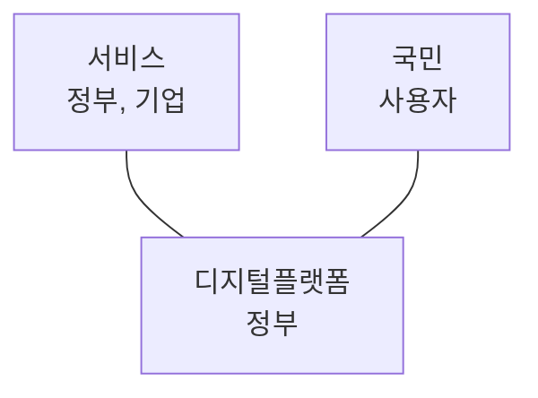

## 디지털 플랫폼 정부 개념

- 모든 데이터가 연결되는 디지털 플랫폼 위에서 국민, 기업, 정부가 함께 사회문제를 해결하고, 새로운 가치를 창출하는 정부
- AI, 빅데이터 등 디지털 심화시대에 데이터활용의 중요 대두, 디지털 플랫폼 비지니스모델 적용 필요

## 디지털 플랫폼 정부 특징, 구성요소, 기대효과

### 디지털 플랫폼 정부 특징

| 구분 | 내용 | 비고 |
| --- | --- | --- |
| ==국민중심== | 모든 국민이 언제,어디서나 디지털서비스 이용 보장 | 디지털 포용 |
| | 공공서비스는 국민이 원하는 방식으로 통합, 선제, 맞춤 제공 | 사용자 중심 서비스 |
| ==하나의 정부== | 모든 데이터가 연결된 디지털 플랫폼으로 하나의 정부 구현 | 부처 간 협업, 데이터 공유 |
| | 행정 프로세스 디지털 중심 재설계 | 행정, 조직, 효율성 증대 |
| ==AI, 데이터 기반== | 공공 데이터는 사람과 기계가독성을 가진 형식으로 전면 개방 | 데이터 활용성 증대 |
| | AI, 빅데이터 기반 정책 결정 | 과학적 정책 결정 |
| ==민관 협력== | 민관협력 혁신 생태계 조성 | 민간 참여 활성화 |
| | 디지털 모법 국가로 국제사회 기여 | 국제적 위상 제고 |

### 디지털 플랫폼 정부 구성요소

| 구분 | 내용 | 비고 |
| --- | --- | --- |
| 플랫폼 제공자 | 디지털 플랫폼 구축, 운영, 데이터 통합, 활용 지원 | 정부 |
| 공급자 | 공공, 민간 서비스, 데이터 제공 | 정부, 공공기관 |
| 소비자, 이용자 | 맞춤형 서비스와 공공 데이터 활용 | 국민, 기업 |
| 플랫폼 생태계 전반 | 플랫폼 전반에 걸친 상호작용 | 데이터, 서비스, 인프라 |

### 디지털 플랫폼 정부의 기대효과

| 구분 | 기대효과 | 내용 |
| --- | --- | --- |
| 정부 | 정부 역량 강화, 신뢰도 향상 | 빅데이터 기반 과학적 정책결정, 투명성 제공 |
| 기업 | 민간부문 성장동력 마련 | 공공 데이터 활용 혁신 서비스 개발 |
| 국민 | 국민 중심의 서비스 제공 | 맞춤형 행정 서비스 제공 |
| 사회 | 사회 전체 발전 도모 | 디지털 격차, 역기능 해소 |

## 디지털 플랫폼 정부의 추가적인 고려사항

| 구분 | 내용 | 비고 |
| --- | --- | --- |
| 관리적 | 부처 내 데이터 정보화로 부서 위상 제고 | CDO, CIO 지정 |
| 기술적 | 제로트러스트 보안체계 구축 | 사이버 위협 대응 |
| 제도적 | 개인정보보호법 개정, 하위 법령 정비 | 개인정보 전송요구권 도입 |
