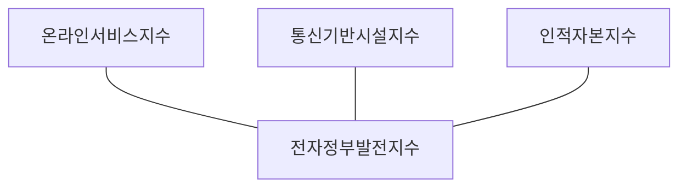

## 전자정부 발전지수 개념

- UN에서 발표하는 각 국의 전자정부서비스 제공 능력, ICT 인프라 수준, 인적자본의 지적 능력을 종합 평가하여 전자정부의 전반적 발전 수준을 나타내는 수치
- 각 국의 발전현황 파악, 우수 사례 공유, 정부정책 참여강화, 국제 협력 추진

## 전자정부 발전지수 구성도, 구성요소

### 전자정부 발전지수 구성도

### 전자정부 발전지수 구성요소

| 구분 | 내용 | 비고 |
| --- | --- | --- |
| 온라인 서비스 지수 | 정부 웹사이트를 통한 서비스 제공수준 평가 | 서비스 범위, 품질, 편의성 |
| 통신 기반시설 지수 | 전자정부의 선행 조건인 통신 인프라 수준 평가 | 인터넷이용자 수, 모바일가입자 수 |
| 인적자본 지수 | 전자정부 이용 일반 국민의 교육 수준 평가 | 성인문해율, 취학률, 교육기관 |

## 전자정부 고려사항

- 전자정부에 대한 범국가적 관심 유도
- 전자정부 선도국 위상에 걸맞는 국제사회 공헌활동 강화
