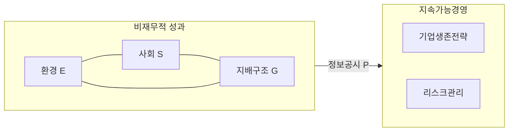

## ESG 개념

- 기업 경영 활동을 ==환경 경영==, ==사회적 책임==, 건전하고 ==투명한 지배구조==에 초점을 둔 지속가능성을 위한 기업 경영의 세가지 ==비재무적 성과지표==
- 세계적 트랜드와 사회 구성원의 관심으로 인해 기업의 지속가능한 성장을 위한 리스크 관리 수단으로 활용
  - 지속가능성 / 지속가능한 발전 / 지속가능 경영

## ESG 구성도, 구성요소, 적용방안

### ESG 구성도

- 정보공시시 ESG 측면의 목표를 검증, 점검하여 투명성 제고

### ESG 구성요소

| 구분 | 내용 | 비고 |
| --- | --- | --- |
| 정보공시 | 투자자, 이해관계자에게 ESG를 투명하게 공개 | ESG 정보공시 방식, 주기, 범위, KPI 등 |
| 환경 | 환경 영향 최소화, 지속가능한 환경 위한 기업 노력 | 환경 경영 목표, 온실가스 배출량, 에너지 사용량 |
| 사회 | 조직구성원, 소비자 등 사회적 책임 이행을 위한 노력 | 정규직 비율, 자발적 이직율, 산업재해율, 정보보호시스템 구축 |
| 지배구조 | 투명하고 책임감 있는 기업 지배구조 확립 | 사외이사비율, 주주권리보호, 윤리경영, 감사기구 설치 등 |

### ESG 적용방안

| 구분 | 기술 | 내용 |
| --- | --- | --- |
| 환경(E) | 스마트 센서 | MEMS 센서, 마이크로 액추에이터, 센서 퓨전 |
|  | 사물 인터넷(IoT) | 스마트 홈, 스마트 시티, 원격 모니터링, 엣지 컴퓨팅, 스마트 그리드 |
| 사회(S) | 가상 현실 | 몰입형 환경, 3D 모델링, 인터랙티브 시뮬레이션, 혼합 현실(MR), 헤드 마운트 디스플레이(HMD) |
| | 로봇 공학 | 자율 이동 로봇(AMR), 드론, 자율 주행, 인공 지능 로봇 |
| | AI | 딥 러닝, 자연어 처리(NLP), 강화 학습, 신경망, 컴퓨터 비전 |
| | 데이터 보안 | 암호화 기술, 데이터 익명화, IPS, IDS, 프라이버시 강화 |
| 지배구조(G) | 블록체인 기술 | 분산 원장, 스마트 계약, 암호화폐, 합의 알고리즘, DApps, NFT |
| | 빅데이터 | 데이터 마이닝, 데이터 시각화, 예측 분석, 실시간 데이터 처리, 데이터 거버넌스 |

## ESG 고려사항

- RE100 인증, 탄소국경조정제도(CBAM) 대응을 위한 재생에너지 사용비율을 지속적으로 높여야함
- K-ESG 가이드라인
