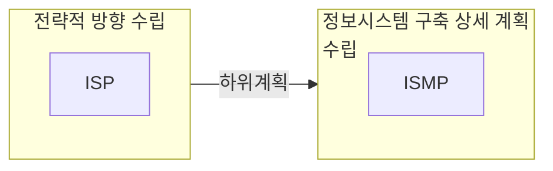

## ISMP 개념

- 정보시스템 구축 사업에 대한 ==제안요청서를 마련==하기 위해 목표시스템을 체계적으로 파악하고 요구사항을 상세히 분석하여 구축 전략 및 이행계획을 수립하는 활동
- ISP의 형식적 수립으로 인한 중복 구축, 대가산정 부적절, 데이터 표준화 미준수, 정보시스템활용률 저조 등 예산 낭비 절감, 구축 및 운영단계에서 발생할 문제 사전 예방

## ISMP 절차도, 구성요소

### ISMP 절차도

> 착방업구이

### ISMP 구성요소

| 단계 | 주요 활동 | 산출물 |
| --- | --- | --- |
| 1. ==프로젝트 착수== | 경영진 지원 조직 형성 | 프로젝트 역할 정의서 |
| | 프로젝트 수행 조직 편성 | ISMP 팀 조직 |
| 2. ==방향성 수립== | 정보화 전략 검토 | 정보화 전략 분석서 |
| | 정보시스템 범위, 방향성 검토 |정보시스템 추진 목표, 방향 보고서 |
| 3. ==업무 및 기술요건 분석== | 업무 및 정보기술 현황 분석 | 아키텍처 분석서 |
| | 업무 및 정보기술 요건 검토 | 정보기술 요구사항 분석서 |
| 4. ==구조 요건 정의==| 요건 간 이행 연관성 분석 | 요구사항 연관표 |
| | 정보시스템 요건 기술서 작성 검토 | 정보시스템 요건 기술서 |
| 5. ==이행 방안 수립== | 분리발주 가능성 평가 | 분리발주 가능성 보고서 |
| | 제안요청서 작성 | RFP |

## ISP, ISMP 비교

### ISP, ISMP 관계도

- ISP로 조직의 정보화 방향 제시, ISP로 특정 정보시스템 구축 및 운영에 대한 구체적 계획 수립

### ISP, ISMP 상세 비교

| 구분 | ISP | ISMP |
| --- | --- | --- |
| 목적 | 목표 모델 설계 | 기능, 비기능 프로젝트 자원 요건 도출 |
| 사업 구분 | 신규 사업 적합 | 재구축 사업 적합 |
| 기업 이해도 | 이해도 낮을 경우 | 이해도 높은 경우 |
| 주요 산출물 | 정보화전략 계획서 | RFP |

## ISMP 추가적 고려사항

- 디지털플랫폼 정부 기본 원칙인 클라우드, 국민 중심, 하나의 정부, AI 데이터, 민간 협력을 우선시 하여 사업 효율성 제고
