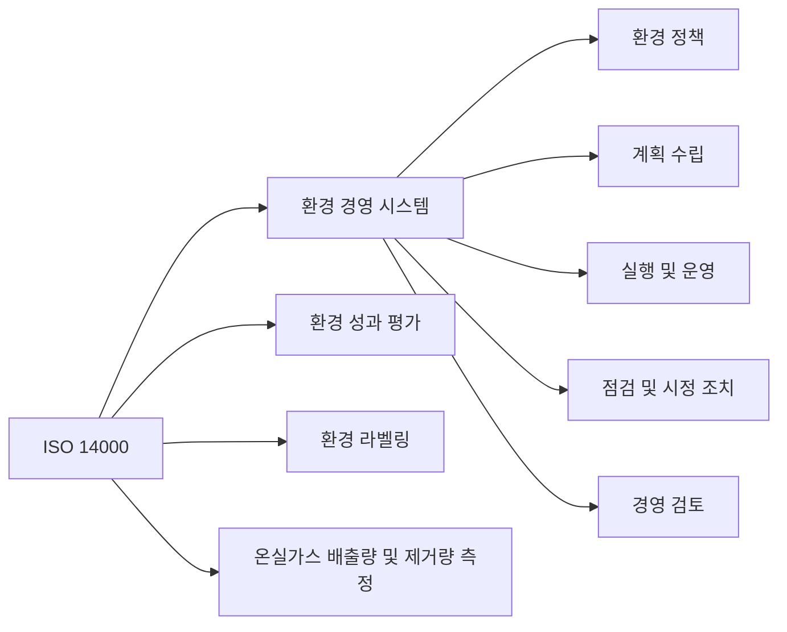

## ISO 14000 개념

- 기업이 ==환경 성과를 개선하고 법규를 준수==하도록 하는 ==환경 경영 시스템(EMS)에 대한 국제 표준==
- 환경 보호의 필요성 증가, 지속 가능한 발전, 파리협약-RE100 등 국제 협약 준수

## ISO 14000 구성도, 구성요소, 적용방안

### ISO 14000 구성도

- ==환경 경영 시스템==, ==환경 성과 평가==, ==온실가스 측정==

### ISO 14000 구성요소

| 구분 | 설명 | 국제기준 |
| --- | --- | --- |
| 환경경영 시스템 | 우선항 규정, 구현반 적용 | ISO 14001/4 |
| 규현지침 | 효과적 구현을 위한 연계적 지침 | ISO 14005 |
| 환경라벨링 | 제3자 인증 환경 마크 지침 | ISO 14020 |
| 수명주가평가 | 제작, 활동 과정 환경영향평가 | ISO 14040 |
| 용어정의 | 환경용어 정의 | ISO 14050 |

### ISO 14000 적용방안

| 구분 | 내용 | 비고 |
| --- | --- | --- |
| Standard | ISO 14001, ISO 14004 등의 구체적 표준 적용 | 환경 경영 시스템 요구사항 및 시스템 가이드라인 제공 |
| Process | 환경 영향 평가, 자원 사용량 모니터링, 폐기물 관리 등 프로세스 도입 | 환경 성과 지표 설정, 데이터 수집 및 분석 |
| Organization | 전사적 환경 경영 체계 구축, 모든 부서 환경 목표 공유 | 부서별 역할과 책임 명확히 정의, 전사적 협력 유도 |
| Technology | 최신 기술 도입, 에너지 효율성 향상, 오염 물질 배출 최소화 | 탄소인지시스템, 오염 방지 기술 도입 |

## ISO 14000 인증 절차, 인증 효과

### ISO 14000 인증 절차

| 구분 | 상세절차 | 설명 |
| --- | --- | --- |
| 도입 준비 | 정보 수집 및 분석 | ISO 14000 표준 이해, 조직 내 환경 관리 요구사항 파악 |
| | 조직 현황 파악 | 기존 환경 성과, 환경 영향, 환경 관리 체계 분석 |
| | TFT 구성 | 환경 경영 시스템 구축을 위한 태스크 포스 구성 |
| | 추진계획 수립 | ISO 14000 인증 추진계획 수립 |
| 구축 및 실행 | 시스템 기본 골격 구성 | 환경 정책, 목표, 프로그램, 조직 구조, 역할 및 책임 설정 |
| | 환경방침 제정 및 실행 | 환경 정책 수립, 전사적 환경 경영 시스템 구축 |
| 인증심사 | 인증 신청 및 상담 | 인증기관에 인증 신청, 인증기관과 상담 |
| | 예비심사 | 인증기관의 예비심사, 환경 경영 시스템 준비 |
| | 문서심사 | 환경 경영 시스템 문서 검토, 인증기관의 문서심사 |
| | 본 심사 | 인증기관의 본 심사, 환경 경영 시스템 실제 운영 확인 |
| | 인증서 발행 | 인증기관의 심의 후 인증서 발행 |

### ISO 14000 인증 효과

| 구분 | 인증 효과 | 비고 |
| --- | --- | --- |
| 비용 측면 | 비용 절감 | 폐기물, 유틸리티, 소모원재 투입감소, 유해물질 투입 감소 |
| | 환경사고 예방 | 사건 사고, 손해배상, 생산 손실 등 비용 감소 |
| | 보험료 감소 | 환경사고 보험료 감소 |
| 기업 경쟁력 측면 | 이미지 개선 | 그린 기업, 신뢰도, 점유율, 투자 촉구 |
| | 무역장벽 극복 | 법,규제 대응, 요구사항 충족, 그린 상품 구매 촉진 |

## ISO 14000 고려사항

- 법규 및 규제 준수, 경영진의 적극적 참여와 지원 필요
- 지속적 개선과 이해관계자 참여, 효과적인 커뮤니케이션 필요
