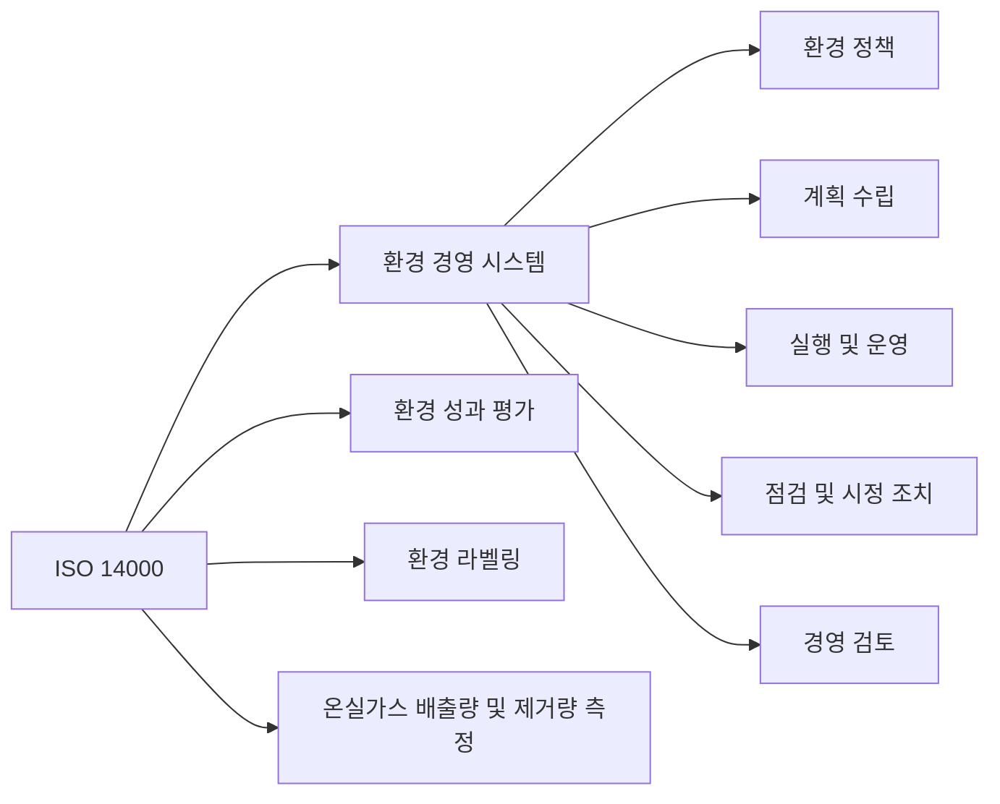

## ISO 14000 개념

- 기업이 ==환경 성과를 개선하고 법규를 준수==하도록 하는 ==환경 경영 시스템(EMS)에 대한 국제 표준==
- 환경 보호의 필요성 증가, 지속 가능한 발전, 파리협약-RE100 등 국제 협약 준수

## ISO 14000 구성도, 구성요소, 적용방안

### ISO 14000 구성도

- ==환경 경영 시스템==, ==환경 성과 평가==, ==온실가스 측정==

### ISO 14000 구성요소

| 구분 | 내용 | 비고 |
| --- | --- | --- |
| 환경 경영 시스템 | 환경 목표 및 방향 설정 | 조직의 전반적인 환경 관리 프레임워크 설정 |
| 환경 성과 평가 | 환경 성과 체계적 평가 | 환경 영향 및 개선 사항 지속적 모니터링 |
| 환경 라벨링 | 제품 환경 성과 표시 | 소비자 인식 향상 및 친환경 제품 판촉 기여 |
| 온실가스 배출량 및 제거량 측정 | 온실가스 배출량 측정 및 관리 | 기후 변화 완화 및 규제 준수 지원 |

### ISO 14000 적용방안

| 구분 | 내용 | 비고 |
| --- | --- | --- |
| Standard | ISO 14001, ISO 14004 등의 구체적 표준 적용 | 환경 경영 시스템 요구사항 및 시스템 가이드라인 제공 |
| Process | 환경 영향 평가, 자원 사용량 모니터링, 폐기물 관리 등 프로세스 도입 | 환경 성과 지표 설정, 데이터 수집 및 분석 |
| Organization | 전사적 환경 경영 체계 구축, 모든 부서 환경 목표 공유 | 부서별 역할과 책임 명확히 정의, 전사적 협력 유도 |
| Technology | 최신 기술 도입, 에너지 효율성 향상, 오염 물질 배출 최소화 | 탄소인지시스템, 오염 방지 기술 도입 |

## ISO 14000 고려사항

- 법규 및 규제 준수, 경영진의 적극적 참여와 지원 필요
- 지속적 개선과 이해관계자 참여, 효과적인 커뮤니케이션 필요
