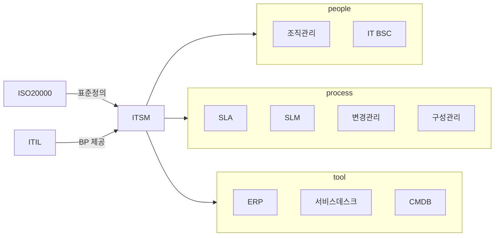

## ISO 20000 개념

- IT 서비스의 품질 보장을 목표로 한 프로세스 기반의 관리 방법
- 서비스 품질 향상, 고객 만족도 증가, IT관리 비용절감, IT관리 리스크 절감

## ISO 20000, ITSM 개념도

- 기업 IT 인프라 및 서비스 전체 수명주기 관리, 지원을 위해 ITIL에 기반한 ITSM 활용

## ITSM 도입 기대효과

| 구분 | 기대효과 | 설명 |
| --- | --- | --- |
| Standard | 서비스 품질 향상 | 표준화된 프로세스와 자동화 |
| Process | 운영 효율성 증대 | 프로세스 간소화 및 자동화 |
| Organization | 협업 강화, 책임 명확화 | 명확한 R&R, 커뮤니케이션 비용 절감 |
| Technology | 비용 절감, 다운타임 감소 | IT 운영비용 절감, 빠른 이슈 해결 |

## ISO 20000 개정사항

| 구분 | 개정사항 | 설명 |
| --- | --- | --- |
| 리스크 중심 | 리스크 기반 사고 요구 | 리스크 관리 중요성 강조 |
| | 단계별 리스크 고려 | 단계별 리스크 체계적 관리 |
| 경영진 의지 | 경영진 도입 의지 강조 | 경영진 참여와 지원 강화 |
| | 수명주기 강조 | 서비스 수명주기 일관성 유지 |
| 신규 항목 | 지식 관리 추가 | 지식 관리 체계화로 품질 향상 |
| | 서비스 카탈로그 관리 추가 | 서비스 목록과 정보 관리 강화 |
