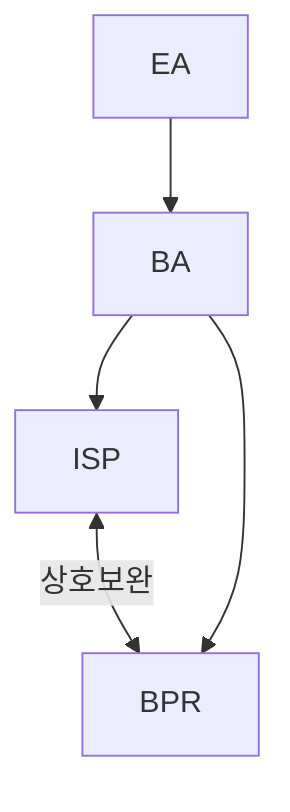

## ISP, BPR 개념

- ISP는 ==기업의 비전과 목표 달성을 위해 ICT기술을 어떻게 활용==할지 전략 수립, BPR은 ==기존 업무 프로세스를 검토하고 혁신==하여 효율성을 극대화하는 전략 수립
- 기업의 비지니스 아키텍처, 전사적 아키텍처를 개선하고 비지니스 목표를 달성하기 위한 필수 요소

## ISP, BPR 절차도, 세부절차

### ISP 절차도, 세부절차

| 단계 | 내용 | 비고 |
| --- | --- | --- |
| 환경분석 | ==비지니스 환경과 내부 역량 파악==, ==기회, 위험요인 식별== | 외부 환경 분석, 내부 환경 분석 |
| 현황분석 | 현재 ==정보시스템 현황파악==, ==벤치마킹==, ==개선방향 설정== | 정보기술 분석, 업무체계 분석 |
| 정보화 비전 및 전략수립 | 조직의 정보화 비전과 ==목표 설정==, ==달성 전략== 수립 | 정보화 비전 정의, 정보화 목표 설정, 정보화 추진 전략 수립 |
| 목표 모델 설계 | ==정보시스템 비전 및 목표설정==, ==아키텍처 설계== | 정보화 전략, 운영관리 체계 |
| 통합 이행계획 | 목표모델 실현을 위한 ==구체적 실행방안== 마련 | 추진전략수립, 추진일정수립 |

### BPR 절차도, 세부절차

| 단계 | 내용 | 비고 |
| --- | --- | --- |
| 핵심 프로세스 분석 | 현재 핵심 프로세스를 분석하여 문제점과 개선 필요성 파악 | 프로세스 분석서, 프로세스 맵 |
| 핵심 프로세스 개선 기회분석 | 분석된 프로세스에서 비효율성이나 중복된 절차를 식별하여 개선 기회 도출 | 개선 기회 리스트, 문제점 진단서 |
| 프로세스 개선 방향 수립 | 개선 목표 및 효과 측정, 평가 기준 마련 | 개선 방향 문서, KPI 설정 |
| TO-BE 프로세스 설계 | 혁신적 프로세스 구현을 위한 실행방안 마련 | TO-BE 프로세스 맵, 실행 계획서 |

## ISP, BPR 비교

| 구분 | ISP | BPR |
| --- | --- | --- |
| 관점 | 전략적 관점 | 전술적 관점 |
| 계획 | 장기적 계획 | 단기적 실행 |
| 개선포인트 | 정보시스템 중심 | 업무프로세스 중심 |

- ISP를 진행하고, 현행 비지니스 프로세스 수준이 낮을 경우 BPR을 상호보완적으로 활용하여 정보시스템에 최적화된 프로세스 수립

## ISP, BPR 도입 시 고려사항

- 성공적인 변화 관리를 위해 이사회, 경영진의 강력한 의지와 지원 필요
- 조직 구성원은 변화하는 환경에 적극적, 지속적 프로세스 개선 노력 필요
