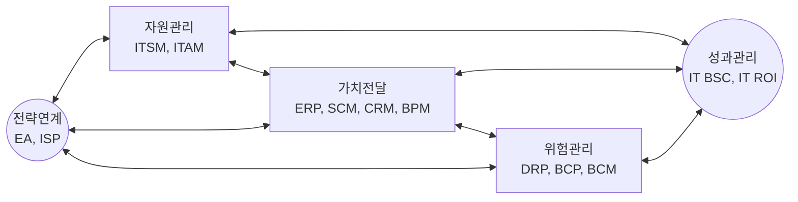
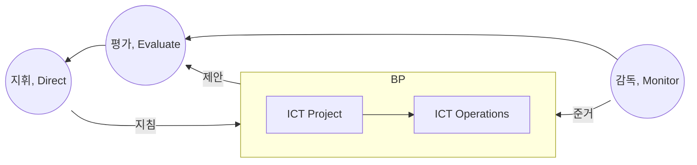

## IT 거버넌스 개념

- 기업의 전략과 목표에 부합하도록 IT 자원과 프로세스를 통제하고 관리하는 프레임워크
- IT의 중요성, 기업 리스크 증대, 효과성, 책임성, 투명성 제고

## IT 거버넌스 프레임워크

- 조직의 IT 자원과 활동을 효과적으로 관리하고, 최적화하여 비지니스 목표 달성

## IT 거버넌스 측정지표

| 구분 | 측정지표 | 설명 |
| --- | --- | --- |
| 전략적 측면 | 전략일치도 | BITA 일치도 |
| - | 컴플라이언스 | 법규 준수 여부 |
| - | 혁신도 | IT 혁신성과 |
| - | 프로젝트 성공률 | 프로젝트별 진척도 |
| 운영 측면 | 위험관리 효과성 | 위험관리 성과 |
| - | 자원 최적화 | 자원 활용 효율성 |
| - | 운영 성과 | IT 서비스 운영 성과 |
| - | 사용자 만족도 | IT 서비스 만족도 |

- KPI, KGI (SMART/Specific, Measurable, Achievable, Relevant, Time-bound)

## IT 거버넌스 효과 측정 방법론

| 구분 | 측정 방법론 | 설명 |
| --- | --- | --- |
| 정량적 | EVA | 경제적 가치 평가 |
| - | ==TCO== | 총 소유 비용 |
| - | TVO | 기술 가치 평가 |
| - | ==CVA== | 비용 효과 분석, NPV, ROI, IRR, PP |
| - | EVS | 경제적 가치 평가 |
| - | TEI | 기술 투자 효과 |
| 정성적 | ==IO== | 정보화 평가 |
| - | IPM | IT 포트폴리오 관리 |
| - | IE | 정보 경제학 |
| 전략적 | ==BSC== | 재무, 고객, 내부, 학습 성과 |
| - | ==IT BSC== | 기업 공헌도, 사용자, 운영 프로세스, 미래 지향 |
| 통계산술적 | ==ROV== | 실물 옵션 가치 |
| - | AIE | 응용 정보 경제학 |

- ISO 38500 기반으로 IT 거버넌스 효과 측정

## ISO 38500

