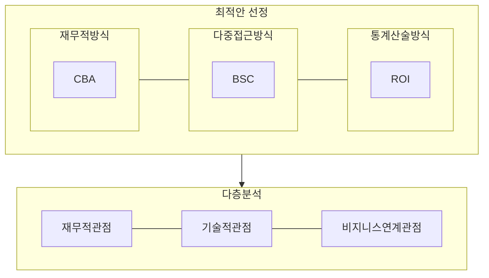

## IT 투자분석 개념

- IT투자에 대한 성과를 객관적, 논리적으로 분석 및 측정하여 효과성을 파악하는 절차
- 중요도와 효과를 사전 분석함으로서 정보화사업의 우선순위 결정, 비용 절감

## IT 투자분석 프로세스, 프레임워크, 분석 방법론

### IT 투자분석 프로세스

| 구분 | 내용 | 비고 |
| --- | --- | --- |
| 현행 분석 및 계획 수립 | 현재 조직의 상태 파악, 투자 계획 수립 | 평가 대산, 기간, 조직 분석 |
| IT투자평가 지표 도출 | 사전, 중간, 사후 평가시 지표 마련 | ==KPI, 베이스라인== |
| 자료수집 및 평가 | 평가지표별 투자효과성 검토 | 자료 수집, 효과 산출 |
| 성과 분석 및 사업가치 분석 | 성과 분석 및 개선방안 도출 | ==CBA== |
| 종합보고 및 피드백 | 투자분석, 결과보고, 피드백 | 성과보고 |

### IT 투자분석 프레임워크

| 구분 | 프레임워크 |
| --- | --- |
| 평가단계 | ==사전평가, 중간평가, 사후평가== |
| 시행추진단계 | 정보화사업 ==준비==, 정보화사업 ==수행==, 정보화사업 ==완료== |
| 성과측정모델 | ==BSC==, ==IT-BSC== |
| 분석기법 | ==NPV==-순현재가치, ==ROI==-투자수익률 - ==IRR==-투자회수기간, ==PP==-내부수익률 |

### IT 투자분석 방법론

- 재무적, 통계산술적, 다중접근 등의 방법론을 통해 최적 분석안을 선택하여 다층 분석 수행

## IT 투자분석 고려사항

- 효율적, 효과적인 IT투자분석을 위해 기업의 IT거버넌스 수립이 우선되어야함
