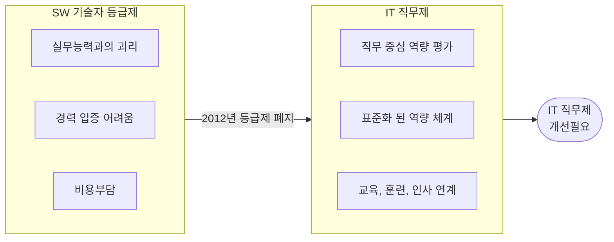

## IT 역량분류 체계 개요

```mermaid
graph LR
  subgraph SW기술자등급제[SW 기술자 등급제]
    direction LR
    실무능력괴리[실무능력과의 괴리]
    경력입증어려움[경력 입증 어려움]
    비용부담
  end

  subgraph IT직무제[IT 직무제]
    direction LR
    직무중심역량평가[직무 중심 역량 평가]
    표준화된역량체계[표준화 된 역량 체계]
    교육훈련인사연계[교육, 훈련, 인사 연계]
  end

  SW기술자등급제 -->|2012년 등급제 폐지| IT직무제 --> 개선필요([IT 직무제<br/>개선필요])
```
