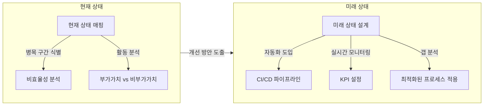

## VSM 개념

- IT 서비스가 고객에게 가치를 전달하는 과정에서 발생하는 모든 활동을 매핑하여 시각적으로 표현하고 최적화하는 기법
- ITIL 서비스 가치 체인(Service Value Chain) 내에서 프로세스 개선과 낭비 제거를 위해 활용 / Lean 원칙 기반 / IT 서비스의 품질과 속도를 지속적 향상

### VSM 개념도, 구성요소, 활용방안

### VSM 구성요소

| 구성 요소 | 설명 | 예시 |
| --- | --- | --- |
| 현재 상태 | 현재 프로세스를 매핑하여 병목 구간 및 비효율성 식별 | 인시던트 관리 프로세스 분석 |
| 미래 상태 | 최적화된 프로세스를 설계하여 이상적인 가치 흐름 구성 | 자동화된 소프트웨어 배포 파이프라인 |
| 갭 분석 | 현재 상태와 미래 상태 간 차이를 분석하여 구체적인 개선 과제 도출 | 처리 시간 단축 목표 설정 |

### VSM 활용방안

| 방안 | 설명 | 비고 |
| --- | --- | --- |
| 병목현상 제거 | 반복적인 승인 단계나 대기 시간 제거 | 불필요한 승인절차 단축 |
| 낭비 최소화 | 비부가가치 활동 제거 | 불필요한 데이터 이동 자동화 |
| 자동화 도입 | DevOps와 연계하여 수작업 프로세스 자동화 | CI/CD 배포시간 단축 |
| 실시간 모니터링 | KPI 설정 및 성과 측정 | KPI, RTO, RPO |

## VSM 도입 효과

| 산업 | 적용 방법 | 효과 |
| --- | --- | --- |
| 금융 | 대출 신청 프로세스 최적화 | 처리 시간 40% 단축, 고객 만족도 상승 |
| IT 서비스 제공 | 인시던트 해결 프로세스 개선 | 평균 처리 시간 30% 감소 |
| 헬스케어 | 환자 데이터 관리 및 진단 절차 간소화 | 데이터 처리 효율성 향상 |

- AI 기반 실시간 데이터 분석과 결합하여 IT 서비스 프로세스 효율성과 품질을 동시 향상
