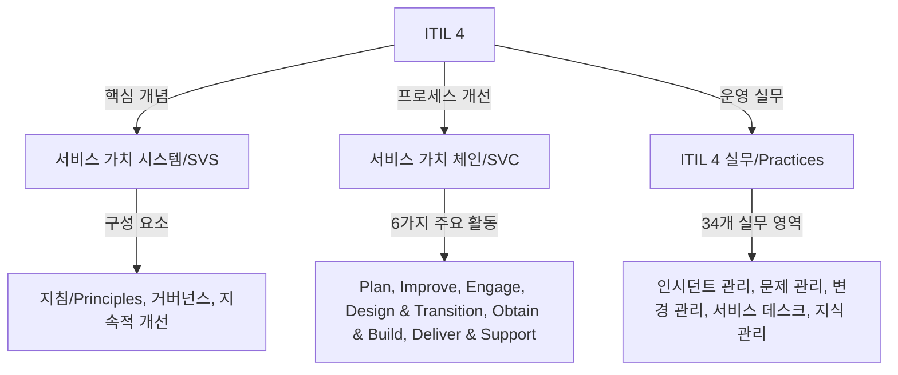

## ITIL

- IT 서비스 관리(ITSM)를 위한 글로벌 표준 프레임워크로, IT 서비스의 품질과 비즈니스 목표 정렬을 최적화하는 역할
- IT 서비스의 효율성 및 품질 개선 / BITA / DevOps, Agile 통합 지원

## ITIL 구성도, 핵심요소

### ITIL 구성도

### ITIL 핵심요소

| 구성 요소 | 설명 | 예시 |
| --- | --- | --- |
| 서비스 가치 시스템 | IT 서비스가 조직의 가치를 창출하는 데 필요한 요소와 활동의 프레임워크 | 거버넌스, 지속적 개선 포함 |
| 서비스 가치 체인 | IT 서비스 제공 프로세스를 6가지 활동으로 분류 | Plan, Improve, Engage 등 |
| ITIL 4 실무 | ITIL 3의 프로세스를 발전시켜 34개 실무 영역으로 확장 | 인시던트 관리, 문제 관리, 변경 관리 등 |

## ITIL을 활용한 서비스 관리 방안, 적용 사례

### ITIL 기반 IT서비스 관리 방안

| 방안 | 설명 | 예시 |
| --- | --- | --- |
| DevOps와 Agile 통합 | CI/CD와 결합하여 변경 관리 자동화 및 배포 속도 향상 | AWS 클라우드에서의 자동화된 배포 |
| 서비스 가치 체인 활용 | 고객 요구에 따라 특정 활동 선택적 적용 | Engage, Improve 단계 반복 실행 |
| 고객 중심 접근 | AI 챗봇을 활용한 신속한 고객 응대 및 피드백 반영 | 서비스 데스크에서 AI 기반 고객 지원 |
| 지속적 개선 | 데이터 기반 실시간 의사결정 및 비즈니스 목표 정렬 | IT 운영 데이터 분석으로 장애 원인 식별 |
| ITIL 실무 통합 | 변경 관리와 문제 관리 통합으로 비즈니스 연속성 유지 | 병원 IT 인프라에서의 장애 방지 |

### ITIL 적용 사례

| 산업 | 적용 방법 | 효과 |
| --- | --- | --- |
| 클라우드 서비스 | AWS에서 변경 관리와 지속적 개선 도입 | 클라우드 서비스 품질 향상 |
| 금융 서비스 | DevOps와 ITIL 4 통합으로 빠른 서비스 제공 | 보안 유지 및 배포 속도 증가 |
| 헬스케어 | 인시던트 관리와 문제 관리 자동화 | 의료 데이터 보호 및 응답 시간 단축 |

- AI, AIOps 기반의 자동화 기술과 통합하여 IT 서비스의 실시간 분석 및 관리 효율성 향상 가능
