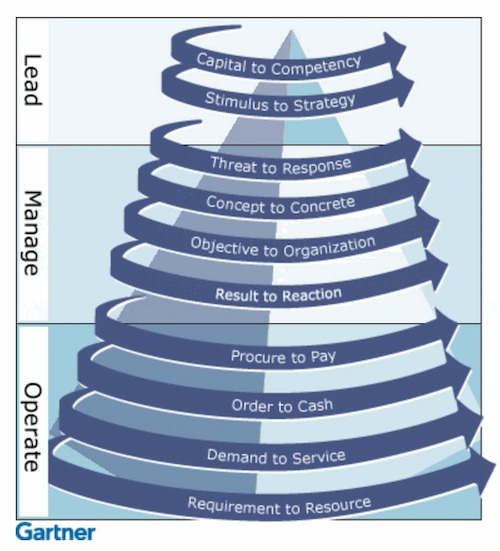

## RTE 개요

> 인식, 분석, 실행

### RTE의 개념

- Real Time Enterprise
- 실시간 정보로 핵심 프로세스를 최적화하고 빠른 의사결정을 지원하는 경영 패러다임

### RTE의 목적

- 다양한 데이터의 수집
- 수집된 데이터의 통합
- 통합된 데이터의 지능적 분석
- 분석된 데이터의 빠른 전략적 의사결정
- 기업의 경쟁력 극대화

## RTE 사이클론 모델과 구성요소

### RTE 사이클론 모델

### RTE 사이클론 모델 구성요소

| 레벨       | 활동                                           | 목표                                                |
| ---------- | ---------------------------------------------- | --------------------------------------------------- |
| Leadership | 전략의 신속한 구현, 비즈니스 역량 개발         | 경영의 투명화, 컨센선스 일치, 전략 결정의 혼란 제거 |
| Manage     | 새로운 기회 개척, 실패 손해 최소화, 위협 변화  | 경영 프로세스 설계, 협업 및 생성 문화 강화          |
| Operate    | 고객서비스 개선, 프로세스 비용 절감, 위험 축소 | 실시간 데이터 캡쳐, 프로세스 간소화 및 통합         |

## RTE 프레임워크 구성요소

| 구분            | 설명                        | 기법           |
| --------------- | --------------------------- | -------------- |
| 프로세스 최적화 | 프로세스 최적화 및 효율화   | BPM, SPO, PM   |
| 성능 관리       | 프로세스 분석 및 정보 제공  | CPM, BSC       |
| 운영 관리       | 프로세스 모니터링 및 효율화 | CRM, ERP, MES  |
| 협업, 지식 관리 | 실시간 지식 공유, 결정 지원 | KMS, Groupware |

## 참조

- [DATA ON-AIR: RTE란 무엇인가](https://dataonair.or.kr/db-tech-reference/d-lounge/report/?mod=document&uid=239617)
