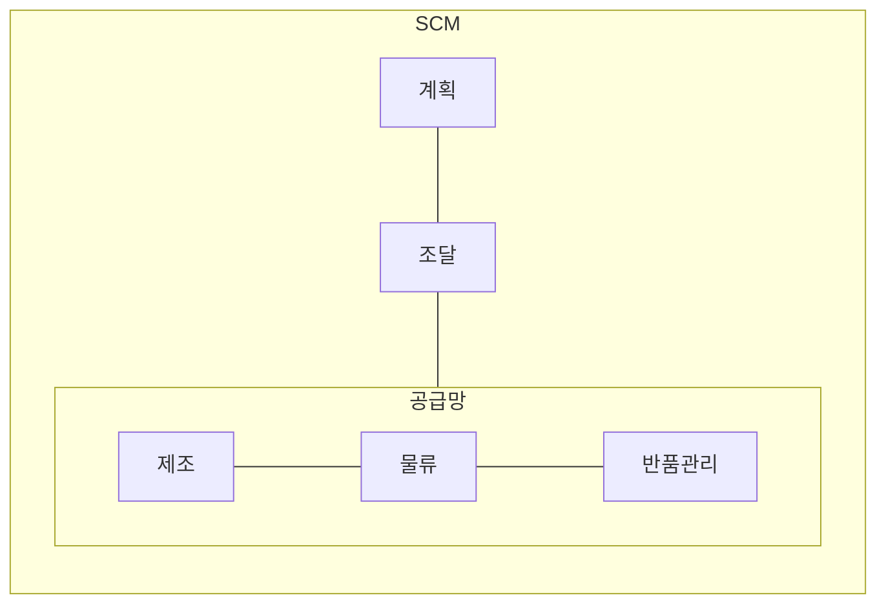

## SCM 개념

- ==고객 서비스 수준을 만족시키면서 시스템 전반의 비용을 최소화==할 수 있도록 제품이 적절한 수량, 시간, 장소에서 생산, 유통이 가능하게 하기 위해 공급자, 제조업자, 창고, 보관업자, 소매상 등을 효율적으로 통합하기 위한 관리 방법
- ==부가가치의 70~80%가 공급사슬==에서 발생, 비용절감, 효율성 증대, 고객 만족도 향상

## SCM 구성도, 구성요소, 적용사례

### SCM 구성도

### SCM 구성요소

| 구분 | 내용 | 비고 |
| --- | --- | --- |
| 계획 | 수요 예측, 자원 계획, 일정 관리 | 예측 정확도 |
| 조달 | 원자재 및 부품 공급자 선정 관리 | 품질, 가격 협상 |
| 제조 | 제품 생산 및 조립 관리 | ==생산효율성== |
| 물류 | 제품의 창고 보관, 운송 관리 | ==적시성== |
| 반품관리 | 제품 반품 및 재고 관리 | 고객 서비스 향상 |

### SCM 적용사례

| 구분 | 사례 | 비고 |
| --- | --- | --- |
| 국내 | 삼성전자 글로벌 공급망 통합관리 | 부품 조달, 생산, 유통 통합 |
| 국외 | 아마존 IT기술 융합 재고 최적화 | 이커머스 선도 모델 |

## SCM 추가적 고려사항

- 자연재해, 정치 이슈 등 다양한 외부 리스크에 대한 대응 계획 수립 및 ==공급망 다각화== 필요
