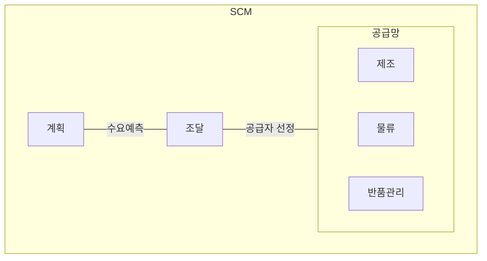

## SCM 개념

- ==고객 서비스 수준을 만족시키면서 시스템 전반의 비용을 최소화==할 수 있도록 제품이 적절한 수량, 시간, 장소에서 생산, 유통이 가능하게 하기 위해 공급자, 제조업자, 창고, 보관업자, 소매상 등을 효율적으로 통합하기 위한 관리 방법
- ==부가가치의 70~80%가 공급사슬==에서 발생, 비용절감, 효율성 증대, 고객 만족도 향상

## SCM 구성도, 구성요소, 적용사례

### SCM 구성도

### SCM 구성요소

| 구분 | 내용 | 비고 |
| --- | --- | --- |
| 계획 | 수요 예측, 자원 계획, 일정 관리 | 예측 정확도 |
| 조달 | 원자재 및 부품 공급자 선정 관리 | 품질, 가격 협상 |
| 제조 | 제품 생산 및 조립 관리 | ==생산효율성== |
| 물류 | 제품의 창고 보관, 운송 관리 | ==적시성== |
| 반품관리 | 제품 반품 및 재고 관리 | 고객 서비스 향상 |

### SCM 적용사례

| 구분 | 사례 | 비고 |
| --- | --- | --- |
| 국내 | 삼성전자 글로벌 공급망 통합관리 | 부품 조달, 생산, 유통 통합 |
| 국외 | 아마존 IT기술 융합 재고 최적화 | 이커머스 선도 모델 |

## 수요예측 7단계, 안전재고, 적정재고

### 수요예측 7단계

| 단계 | 내용 | 비고 |
| --- | --- | --- |
| 1 | 예측 목적과 기간 설정 | 기준, 산출 대상 확정 |
| 2 | 필요한 자료 수집 | 설문 자료 조사, 통계 분석 |
| 3 | 수요 영향 요인 분석 | 시장동향, 성장률, 소비자 욕구 |
| 4 | 수요 예측 방법 결정 | 정성적, 정량적 방법 |
| 5 | 예측 실시 | 여러 기법 활용, 오차 분석 |
| 6 | 예측 자료 비교 | 과거 실적과 예측 비교 |
| 7 | 수요 예측 활용 가치 극대화 | 기업별 브랜드별 제품 세분화 |

### 안전재고, 적정재고

| 구분 | 안전재고 | 적정재고 |
| --- | --- | --- |
| 개념 | 수요와 변동성에 대비해 보유하는 추가적인 재고 | 안전재고에 경제적 측면을 고려한 최적의 재고수량 |
| 목적 | 재고 부족 방지 | 수요 충족 및 재고 비용 최소화 |
| 산정요건 | 수요변동, 리드타임, 서비스 수준 | 일평균 수요, 추가재고, 전략재고 |
| 산정방법 | 변동요인에 따라 최대 리드타임 고려 | 안전재고 + 추가재고 |
| | 일평균 판매량 × 평균 리드타임 | 평균수요 × 평균 리드타임 |
| 목표 | 과한 안전재고는 비용 증가 | 수요 예측 실패 시 부족 및 과잉 발생 |

## SCM 추가적 고려사항

- 자연재해, 정치 이슈 등 다양한 외부 리스크에 대한 대응 계획 수립 및 ==공급망 다각화== 필요
