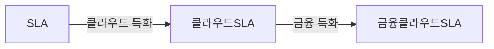

## SLA 개념

- 정보시스템 사용자와 공급자 사이 상호 동의에 의하여 서비스 수준을 정량화하여 명시적으로 정의하고, 서비스 수준이 미달되는 경우 손해배상을 하도록하여 서비스 품질을 보장하기 위한 약정서

## SLA, 클라우드SLA, 금융클라우드SLA 주요 지표

### SLA 주요지표

| 구분 | 지표 | 내용 |
| --- | --- | --- |
| 서비스 가용성 | 가용성 | 서비스 접근 가능한 시간 비율 |
| - | 평균복구시간 | 장애시 복구 완료까지 걸리는 평균 시간 |
| - | 평균고장간격 | 장애 발생 간 평균 시간 |
| 데이터 백업 및 복구 | 백업 주기 | 정기적 백업 주기 |
| - | 백업준수율 | 계획된 백업 정상 수행 비율 |
| - | 데이터 복구시간 | 복구요청으로부터 완료 시간 |
| - | 백업데이터 보관기간 | 백업데이터 보존 기간 |
| 고객지원 | 고객요청 처리시간 | 요청 접수부터 처리 완료까지 시간 |
| - | 고객요청 처리율 | 처리된 요청 비율 |
| - | 요청적기 처리율 | 기간 내 요청 처리 비율 |
| - | 변경 반영시 오류율 | 변경 적용시 오류 발생 비율 |

- 클라우드 SLA는 SLA의 주요 지표를 표함하여 클라우드 환경의 특성 반영

### 클라우드 SLA 주요 지표

| 구분 | 지표 | 내용 |
| --- | --- | --- |
| 성능 | 응답시간 | 요청에 대한 평균 응답 시간 |
| - | 처리량 | 초당 트랜잭션 처리량 |
| - | 지연시간 | 네트워크 지연 시간 |
| 확장성 | 동시접속 가능 사용자 | 동시 요청 가능 트랜잭션 |
| - | 자원할당량 | 서버 자원 할당량 |

- 금융 클라우드 SLA는 클라우드 SLA 주요 지표를 포함하여 금융 분야의 특수성 반영

### 금융 클라우드 SLA 주요 지표

| 구분 | 지표 | 내용 |
| --- | --- | --- |
| 보안 | ISMS 인증 | ISMS, ISMS-P 인증 여부 |
| - | 침해사고 대응시간 | 침해시 평균 대응시간 |
| 규제 준수 | 금융 관련 법규 준수 | 정보통신망법, 개인정보보호법 |
| 데이터 처리 위치 | 금융데이터 처리 위치 | 국내, 해외서버 |

- 규제준수 및 데이터 처리, 폐기에 대한 SLA 협의 필요

## SLA 추가적인 고려사항

- 비지니스 환경, 기술변화 등을 고려하여 SLA를 정기적으로 검토하고 개선 필요
