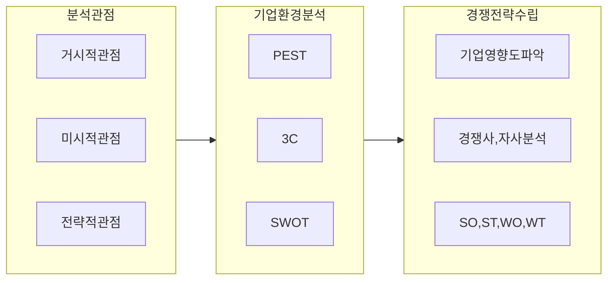

## SWOT, 3C, PEST 개요

- 거시적, 미시적, 전략적 분석을 통해 기업 환경을 분석하고 경쟁전략 수립

## PEST, 3C, SWOT 분석 요소

### PEST 분석 요소

| 구분 | 내용 | 분석 요소 |
| --- | --- | --- |
| 정치 | 정부의 정책, 정치적 환경 | 세금, 법, 관세, 풍토 |
| 경제 | 경제적 환경 | 경제성장률, 인플레이션, 환율, 금리 |
| 사회 | 사회문화적 환경 | 전통, 관습, 양식, 종교 |
| 기술 | 기술적 진보와 기술 환경 | 정보기술, 빅데이터, AI |

### 3C 분석 요소

| 구분 | 내용 | 분석 요소 |
| --- | --- | --- |
| 자사 | 자사의 역량 | 기획, 설계 수준, 연구 개발 인력 수준 |
| 경쟁사 | 경쟁사의 역량 | 마켓쉐어, 매출, 이익 규모, 경쟁력 |
| 고객 | 고객의 요구사항 | 고객 특성, 시장성장률, 시장성숙도 |

### SWOT 분석 요소

| 구분 | 내용 | 분석 요소 |
| --- | --- | --- |
| 강점 | 자사의 장점 | 기술, 노하우, 인력, 자금, 브랜드 |
| 약점 | 자사의 약점 | 인력, 자금, 브랜드, 기술, 노하우 |
| 기회 | 외부환경의 기회 | 시장 확대, 기술 발전, 정책 변화 |
| 위협 | 외부환경의 위협 | 경쟁사, 기술 발전, 정책 변화 |
| 분석전략 | 강점과 기회를 활용, 약점과 위협을 극복 | SO(Max-Max), ST(Max-Min), WO(Min-Max), WT(Min-Min) |

- 내부조건은 7S, 외부환경은 5F로 추가 분석
