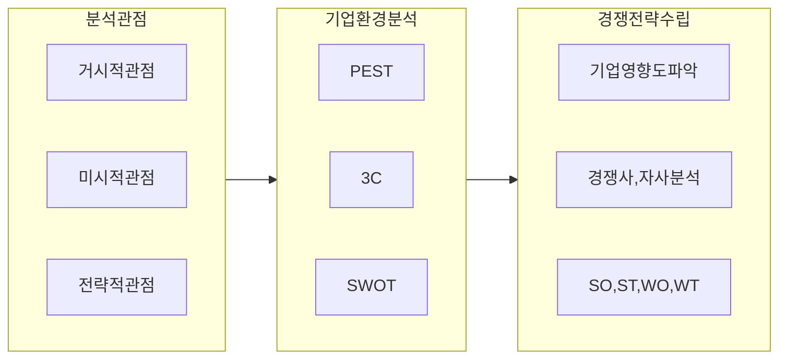

## SWOT, 3C, PEST 개요

```mermaid
graph LR
  subgraph 분석관점
    direction LR
    거시적관점
    미시적관점
    전략적관점
  end
  subgraph 기업환경분석
    direction LR
    PEST
    3C
    SWOT
  end
  subgraph 경쟁전략수립
    direction LR
    기업영향도파악
    경쟁사,자사분석
    SO,ST,WO,WT
  end

  분석관점 --> 기업환경분석 --> 경쟁전략수립
```

- 거시적, 미시적, 전략적 분석을 통해 기업 환경을 분석하고 경쟁전략 수립

## PEST, 3C, SWOT 전략 분석

### PEST

### 3C

### SWOT

- 내부조건은 7S, 외부환경은 5F로 추가 분석
