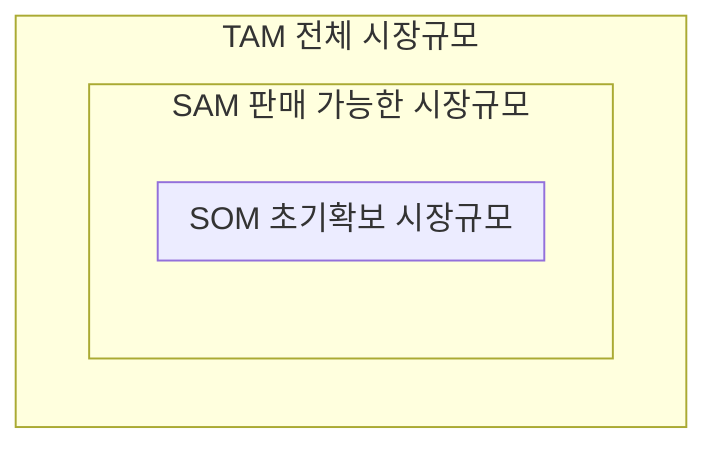

## TAM, SAM, SOM 개념

- 제품, 서비스의 시장규모와 경쟁력을 예측하여 성장가능성과 비지니스 전략을 수립하기 위한 프레임워크
- 시장 잠재력 파악, 투자 유치, 자원 배분, 마케팅 전략 수립에 활용

## TAM 개념도

- 제품이나 서비스를 제공할 시장의 전체 규모와 확보시장규모를 파악하여 타겟기반 전략수립

| 구분 | TAM | SAM | SOM |
|---|---|---|---|
| 타겟 규모 | 넓음 | 중간 | 적음 |
| 전환가능성 | 낮음 | 중간 | 높음 |

## TAM, SAM, SOM 측정지표

| 구분 | 측정지표 | 설명 |
| --- | --- | --- |
| TAM | 비지니스 도메인 크기 | 제품이나 서비스를 제공할 수 있는 전체 시장규모 |
| - | 시장 상한선 | 시장의 최대 규모 |
| SAM | 판매 가능 시장규모 | 제품이나 서비스를 판매할 수 있는 시장규모 |
| - | 고객 세분화 | 제품이나 서비스를 구매할 수 있는 고객군 |
| SOM | 특정기간 내 확보가능한 시장규모 | 초기 단계에서 확보할 수 있는 시장규모 |
| - | 핵심 타겟 선정 | 초기 단계에서 확보할 수 있는 타겟 고객군 |

## TAM, SAM, SOM 활용방안

| 구분 | 활용방안 | 설명 |
| --- | --- | --- |
| 사업계획수립 | 목표 시장설정 | 제공 시장에 대한 계획 수립 |
| - | 마케팅 전략 수립 | 분석 데이터 기반 마케팅 전략 수립 |
| 투자 유치 | 사업 잠재력 설명 | 시장 규모 파악하여 사업 설명 구체화 |
| - | 투자 유치 | 투자자에게 사업 잠재력 설명 |
| 자원 배분 | 제한된 자원의 효율적 배분 | 한정된 자원의 전략적 배분 |
| - | 사업 성장 전략 수립 | 지속적 성장을 위한 전략 수립 |
