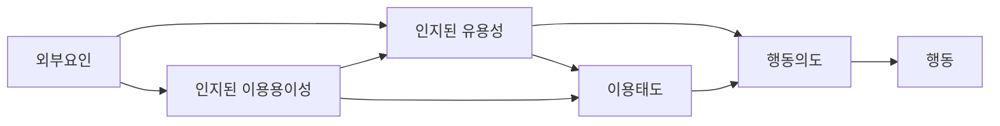
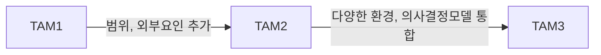

## TAM 개념

- 사용자가 새로운 기술을 수용하는 과정에서 인지된 유용성과 인지된 이용용이성을 기반으로 이유를 설명하는 이론적 모델
- 기술 도입시 발생할 수 있는 문제를 사전 파악, 사용자의 신기술 수용여부 예측

## TAM 구성도, 구성요소

### TAM 구성도

- 인지된 유용성과 이용용이성을 기반으로 형성된 태도는 개인 신념과 감정을 투영하여 행동 영향

### TAM 구성요소

| 구분 | 내용 | 비고 |
| --- | --- | --- |
| 인지된 유용성 | 신기술을 활용하여 자신의 업무 성과가 개선될 것이라고 믿는 정도 | 효율성, 생산성, 편의성 |
| 인지된 이용용이성 | 신기술을 활용하는 것이 많은 노력을 필요로 하지 않는다고 믿는 정도 | 사용자 친화성, 학습용이성 |
| 이용태도 | 신기술을 사용하는 것에 대한 개인의 태도 | 긍정적 태도, 부정적 태도 |

## TAM 비교

| 구분 | TAM | TAM2 | TAM3 |
| --- | --- | --- | --- |
| 구성요소 | 인지된 유용성, 인지된 이용용이성 | +주관적 규범, 사회적 이미지, 업무 관련성, 결과 및 품질 | + 컴퓨터 자기 효능감, 외부 지원 인식, 컴퓨터 불안, 유의성 |
| 적용범위 | 정보시스템, SW, HW | 모바일 앱 등 확장 | 다양한 환경 대응 |
| 목적 | 기술수용의도, 실제 행동 예측 | 외부요인 포함하여 확장 | IT에 대한 조직 구성원 의사결정 통합모델 제시 |

## 신기술 도입시 추가적인 고려사항

- 비용 측면, 조직구성원 측면
- 설문조사, 동향 파악, VoC, ISO 25000...
