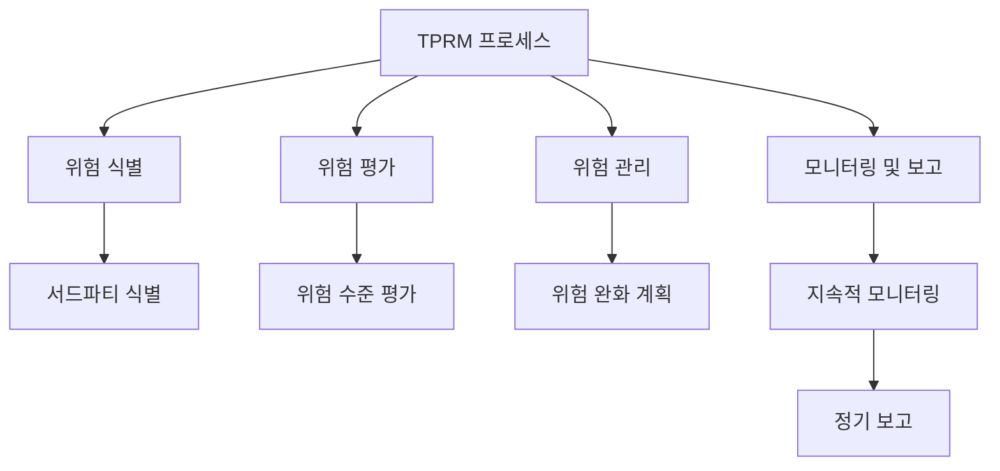

## TPRM 개념

- 조직이 외부 파트너, 공급업체, 서비스 제공자 등 서드파티와의 관계에서 발생할 수 있는 리스크를 식별, 평가, 관리 및 모니터링하는 프로세스
- 규제 준수, 평판 관리, 정보 보안, 재무 리스크 관리

## TPRM 구성도

## TPRM 구성요소

| 구분 | 내용 | 비고 |
|---|---|---|
| 정책 및 절차 | 서드파티 리스크 관리를 위한 정책과 절차 수립 | 조직 내부 규정 준수 |
| 리스크 평가 | 서드파티와 관련된 리스크 식별 및 평가 | 위험 수준에 따른 대응 |
| 계약 관리 | 서드파티와의 계약 체결 및 관리 | 계약 조건 명확화 |
| 모니터링 | 서드파티의 활동 및 성과 지속적 모니터링 | 정기적인 점검 필요 |
| 보고 및 통제 | 리스크 관리 상태 및 성과에 대한 보고와 통제 | 경영진 보고 |

## TPRM 적용단계 (OCC 가이드라인 기반)

| 단계 | 구분 | 내용 |
|---|---|---|
| 1단계 | ==계획== | 서드파티 사용 계획 수립, 리스크 평가 |
| 2단계 | ==서드파티 선정== | 잠재적인 서드파티를 평가, 실사 수행 후 적합한 파트너 선정 |
| 3단계 | ==계약== 협상 및 체결 | 서드파티 계약 협상 및 체결 |
| 4단계 | 지속적 ==모니터링== | 서드파티 성과, 리스크 지속적 모니터링 |
| 5단계 | ==관계 종료== | 서드파티 관계 종료 관리, 긴급 사태 관리 |

## TPRM 고려사항

- SBOM 도입을 통해 서드파티 소프트웨어의 구성 요소  파악 가능
- 잠재적인 보안 취약점과 장애, 재해 시의 위험의 빠른 식별 및 대응 가능
