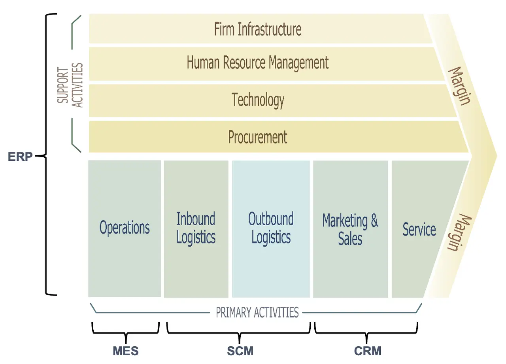
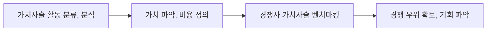

## 가치사슬 개념

- 고객에게 가치를 제공함에 있어 마진을 극대화하기 위한 일련의 활동, 기능, 프로세스
- 경쟁 우위 확보, 비용 절감, 프로세스 개선, 전략적 의사결정 지원, 고객 가치 증대, 기술 혁신 도입

## 가치사슬의 구성도, 구성요소, 분석 절차

### 가치사슬 구성도

### 가치사슬 구성요소

| 구분 | 활동 | 내용 |
| --- | --- | --- |
| 주요활동 | 생산활동 | 원재료를 제품으로 변환하는 과정 |
| - | 물류활동 | 원재료, 자재 수급, 저장, 제품, 고객 전달 과정 |
| - | 고객관리 | 제품 마케팅, 판매, 고객 지원 |
| 지원활동 | 기업 인프라 | 회사 전반 경영, 재무, 법무 등 |
| - | 인적자원 관리 | 직원 채용, 교육, 보상 등 |
| - | 연구 개발 | 제품과 프로세스 연구 및 지속적 개선 |
| - | 조달 | 자재와 서비스의 구매 |

- 전체 가치사슬 내 자산관리를 위해 ERP 활용

### 가치사슬 분석 절차

## ERP, SCM, MES, CRM 비교

| 구분     | ERP          | MES        | SCM             | CRM            |
| -------- | ------------ | ---------- | --------------- | -------------- |
| 목적     | 전사지원     | 생산관리   | 물류/공급망관리 | 고객관리       |
| 대상     | 전사활동     | 공정       | 유통            | 고객           |
| 활동     | 전사자원통합 | 통합 생산  | 공급망 최적화   | 마케팅, 서비스 |
| 가치사슬 | 주요+보조    | 주요       | 주요            | 주요           |
| 신기술   | DX           | 디지털트윈 | 빅데이터        | O2O            |

## 가치사슬 추가적인 고려사항

- 최신 기술동향 파악하여 가치사슬에 통합하여 기업 경쟁력 및 효율성 강화

## 참조

- [IBM: 가치 사슬 분석이란 무엇인가요?](https://www.ibm.com/kr-ko/topics/value-chain-analysis)
