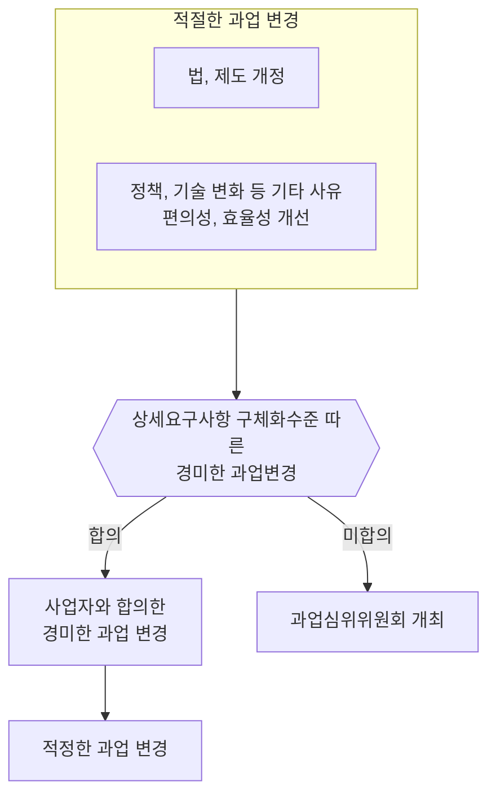

## 과업심의 가이드 개념

- ==공공 SW사업 계획 단계==에서 ==과업 확정과 사업 기간의 적정성 평가를 지원==하고, ==과업 내용 변경시 절차를 준수==하도록 하기 위한 가이드
- SW사업은 산출물이 구체화될 때 무형의 계약목적물을 다루므로, ==과업 변경시 합리성, 공정성을 확보==하고, ==발주처와 사업자간 원활한 업무수행을 지원==하기 위해 필요

## 과업변경 적정성 판단기준 개념도, 검토항목, 기대효과

### 과업변경 적정성 판단기준 개념도

### 과업변경 적정성 판단기준 검토항목

| 구분 | 내용 | 비고 |
| --- | --- | --- |
| 적정한 과업변경 | 법령 개정 등 법제도 변경 | 과업심의위원회 심의 권고, 변경시 기간, 금액 등 후속 협의 |
| | 기술, 정책적 환경 변화 | 과업심위위원회 심의 권고, 예산 절감, 대국민 편의, 행정효율 개선 가능한 경우 |
| | 수,발주자간 사업 기간 조정 없이 합의한 경미한 과업 변경 | 심의 불필요, 필요시 계약기간 조정 등 권고 |
| 불필요한 과업변경 | 적절한 과업 변경에 해당하지 않는 과업변경 | 제도 변화 무관, 예산 절감 효과 없음, 수,발주자 간 합의 등 |

### 과업심의 가이드 기대효과

| 구분 | 기대효과 | 비고 |
| --- | --- | --- |
| 발주자 | 명확한 과업 범위 설정을 통한 예산 낭비 방지 | 과업변경 최소화 노력 |
| 사업자 | 과업 변경시 합리적 절차 통한 권리 보호 | 과업 규모 산정 용이 |
| 기타 | SW사업의 효율성, 품질 향상 | SW사업 관련 분쟁 감소 |

## 과업변경시 고려사항

- 정통법으로 기능점수를 산정하여 과업 변경에 대한 정확한 비용 추정 필요
